<div align="center">

# Kursi

*Kursi ke liye kuch bhi karega.*  
*He'll do anything for the chair.*

[](https://github.com/darkpandawarrior/Kursi/actions/workflows/ci.yml)
[](https://github.com/darkpandawarrior/Kursi/actions/workflows/quality.yml)


[](LICENSE)

</div>

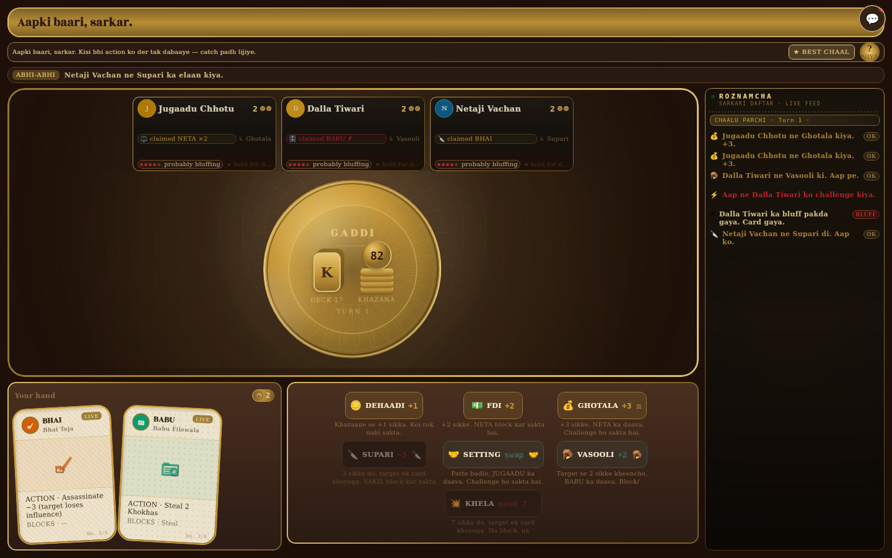

*सब मिले हुए हैं।*  
Everyone is in on it.

---

Bluffing card game set in a satirical India corporate-political underworld. 2–10 players. Five roles — six at large tables. Every player hides two cards face-down. Every player lies about what they are.

Inspired by Coup (Indie Boards and Cards, 2012). Theme, characters, code, visuals — all wholly original.  
Built in Kotlin Multiplatform. One codebase, four targets: Android, iOS, JVM desktop, Kotlin/Wasm.

---

## The world

The Neta has been making promises since before you were born and has the file extensions to prove it. The Bhai owns three silences and a steel foundry. The Babu's approval has been pending since 2007. The Jugaadu knows someone who knows someone who knows a shortcut. The Vakil has already read the clause that saves him. The Patrakaar has a source inside. 

You're at the table. So are they.  
The chair at the head is empty.

---

## Home

| Home | Home with rank strip + daily challenge |
|:-:|:-:|
| 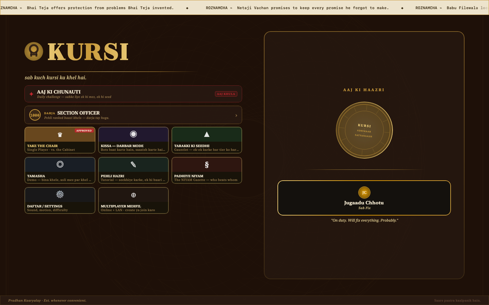 | 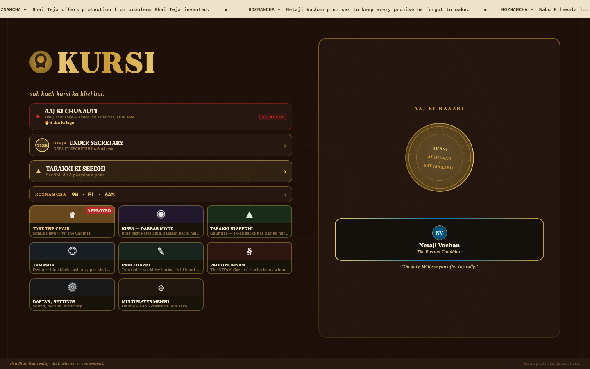 |

From home you can start a new game, enter GAUNTLET mode, browse the Niyam Gazette (full rule reference), access online play, or review your career stats and rankings. Once you've played enough games, a local ELO rating appears — with a daily challenge (Aaj ki Chunauti) and your current winning streak.

---

## The six roles

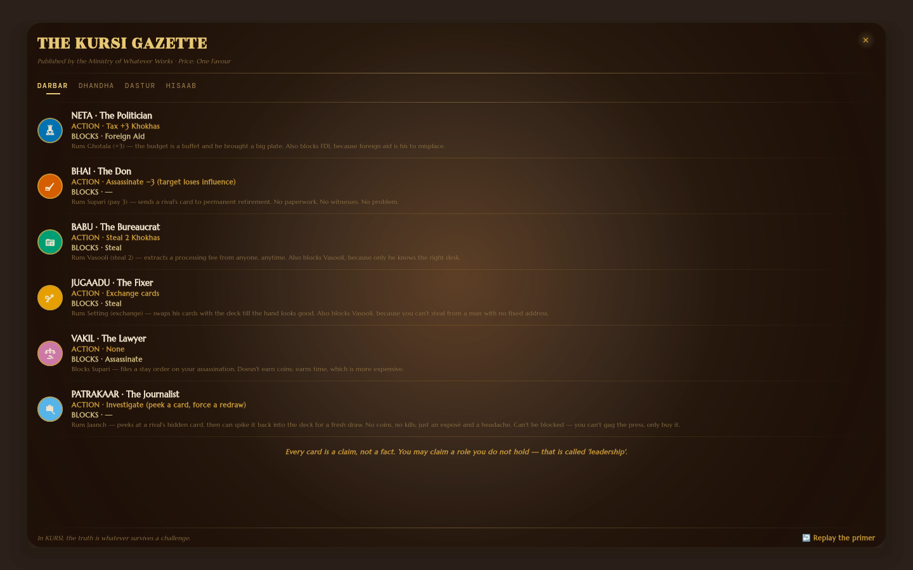

All six roles are in the Niyam Gazette, available mid-game without interrupting play.

Everyone at the table holds two cards — face-down. On your turn you claim any role and take the matching action, whether you actually hold it or not. Challenges and blocks are also claims. The whole table is lying. The question is who gets caught.

---

### Neta — Netaji Dhanpat Rai Vachan
*The Eternal Candidate. Made entirely of promises.*

Takes **GHOTALA** — the party's share of FDI, routed correctly, he assures you. +3 Khokha (coins). Has taken it every time. Will take it again. Also blocks everyone else from taking **FDI** (Foreign Aid, +2) — that money was already committed to a constituency project.

**Action:** GHOTALA +3 · **Blocks:** FDI (Foreign Aid)

---

### Bhai — Bhai Teja  
*Owns the Silence. Quiet, slow, unbothered.*

Issues **SUPARI**. It costs 3 Khokha, and the target loses an influence card. Bhai doesn't explain. He also doesn't need to. No one blocks Supari except the one lawyer everyone keeps around for exactly this.

**Action:** SUPARI — pay 3, target loses a card · **Blocks:** —

---

### Babu — Babu Filewala
*Approver of Nothing. Power through the comma.*

Does **VASOOLI** — extracts 2 Khokha directly from another player. The collection is official. The paperwork is in order. Also blocks Vasooli from others — that file for unauthorized extraction has already been rejected at his desk.

**Action:** VASOOLI — steal 2 from target · **Blocks:** VASOOLI (Steal)

---

### Jugaadu — Jugaadu Chhotu
*The Fix-It Man. Solutions mostly illegal.*

Does **SETTING** — draws two extra cards from the pile, keeps what he wants, returns the rest. Nobody knows what he's holding after a Setting. Also blocks Vasooli — something in his arrangement makes the extraction impractical.

**Action:** SETTING — draw 2, keep what you need · **Blocks:** VASOOLI (Steal)

---

### Vakil — Vakil Loophole
*The Silver Tongue. Knows three exceptions to every rule.*

Has no action of his own. Doesn't need one. Blocks **SUPARI** — the Assassin's move hits a procedural wall every time. Whatever exception applies, Vakil has already filed the brief.

**Action:** — · **Blocks:** SUPARI (Assassinate)

---

### Patrakaar — *the 6th role, enters at larger tables*
*Has a source inside. Knows things no one said out loud.*

Does **JAANCH** — privately examines one of a target's face-down cards. The Patrakaar alone learns what it is. Then decides: let it stay, or force the target to shuffle it back into the deck and draw again. An information-then-disruption move. Not blockable.

**Action:** JAANCH — secretly examine a target's card; optionally force reshuffle · **Blocks:** —

---

## How you play

| Your turn — pick an action | Declare, then confirm | Block, challenge, or let it pass? |
|:-:|:-:|:-:|
| 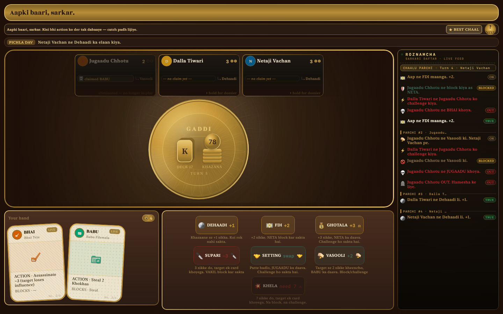 | 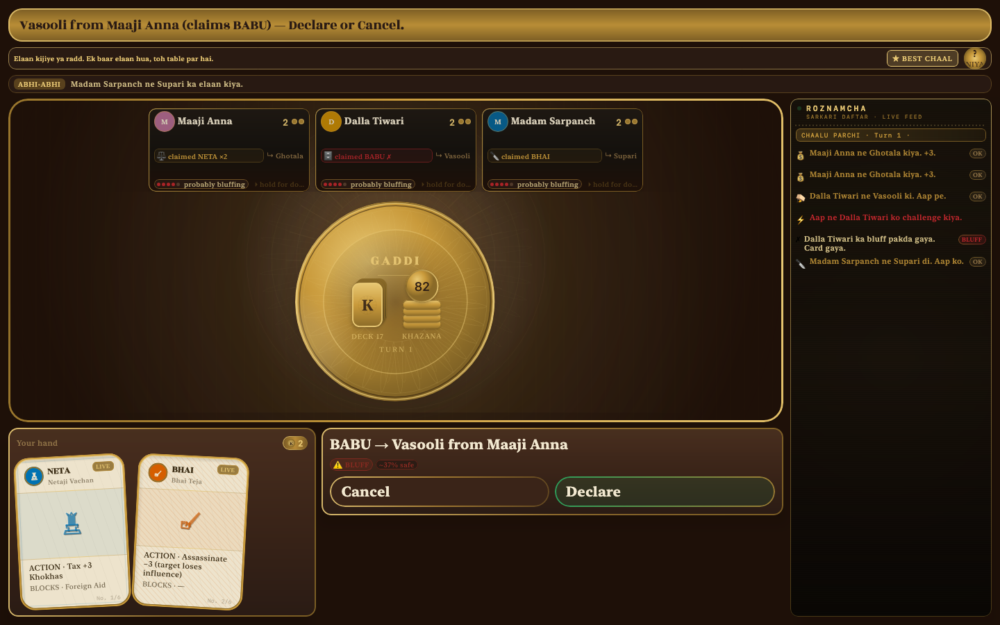 |  |

Everyone starts with 2 Khokha and 2 cards. On your turn:

- **DEHAADI** — take 1 coin. No claim, no block, no challenge. Always legal.
- **FDI** — take 2 coins. No claim needed. Neta can block it.
- **GHOTALA** — claim Neta, take 3. Anyone can challenge your claim.
- **SUPARI** — claim Bhai, pay 3, target loses a card. Vakil can block. Anyone can challenge.
- **VASOOLI** — claim Babu, steal 2 from a target. Babu or Jugaadu can block. Anyone can challenge.
- **SETTING** — claim Jugaadu, draw 2 and pick which to keep. Anyone can challenge.
- **JAANCH** — claim Patrakaar (6+ player tables), privately examine a target's card. Anyone can challenge.
- **KHELA** — pay 7, pick a target, they lose a card. No claim, no block, no challenge. Mandatory at 10 coins.

**Challenge:** If you think a claim is false, challenge it. The claimant flips the card. Caught lying — they lose influence. Truthful — the challenger loses influence instead. A surviving, proven claim gets shuffled back and redrawn.

**Block:** Claim the blocking role. The original actor can challenge your block — same rules apply. If no one challenges, the block stands.

| Block step with odds | Exchange — keep your roles | Influence lost |
|:-:|:-:|:-:|
| 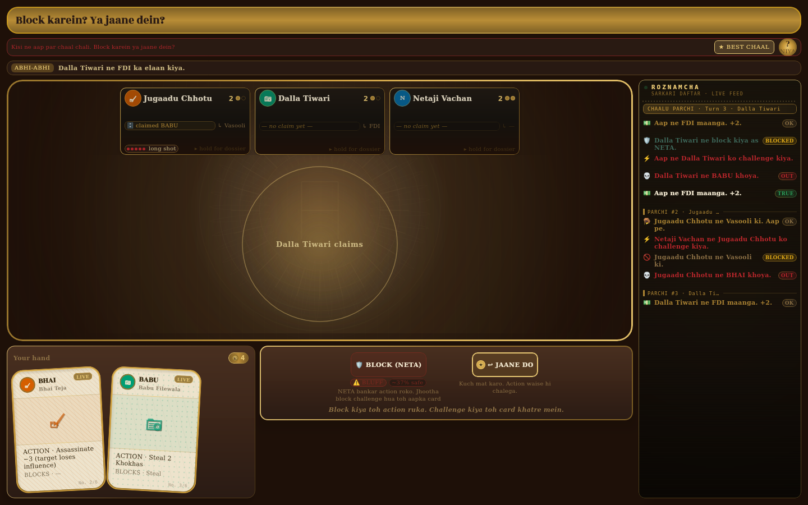 | 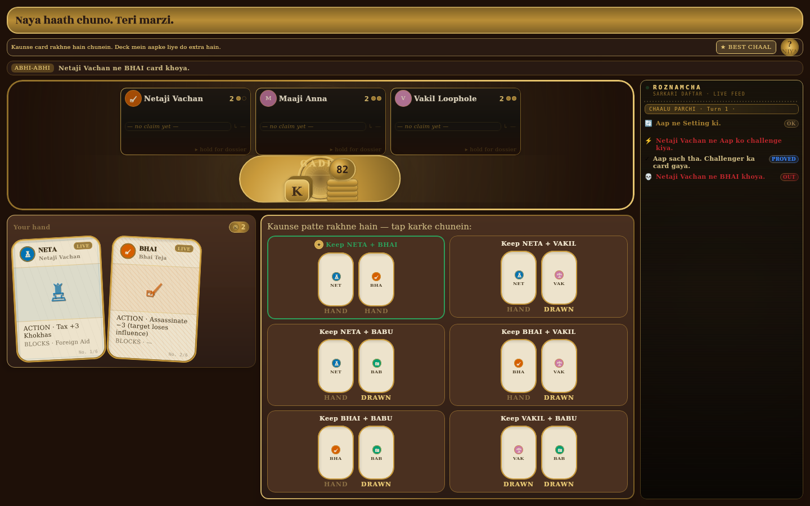 | 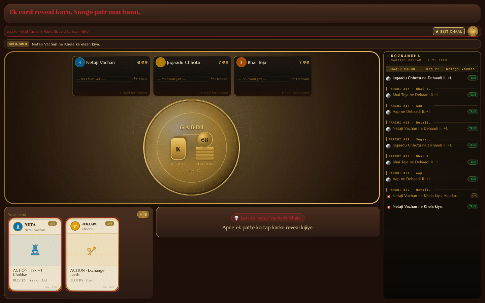 |

Last player with influence wins the **Gaddi**.

---

## DARBAR — the social layer


DARBAR is the layer above the engine. Bots have memory, moods, and grudges. They talk to each other. They form pacts. They spread stories. And you can intervene — strategically.

Four story arcs run simultaneously, triggered by in-game events:

**GATHBANDHAN** — Two bots make a quiet agreement to not target each other. The whisper is visible at the table. The defection, eventually, is not. Watch for who breaks first.

**AFWAAH** — Someone starts a rumour about another player's role. It spreads across the table. Players begin acting on it — targeting the accused, avoiding them, adjusting their own claims — even when the rumour isn't true. Especially when it isn't.

**STING** — A bot "leaks" a real card claim. Now the whole table knows what that player is supposedly holding. The target has to decide: act normally and invite the read, or overcorrect and invite suspicion.

**BADLA** — You SUPARI someone. They announce it. They follow through on it — even when it costs them strategically. Grudges don't expire at the end of the round.

As the human, you can **fuel an Afwaah**, **broker a Gathbandhan** with a bot, **taunt** someone into a Badla, or **leak** information to start a Sting. The chat suggestions in the DARBAR tray show what you can say and what arc it advances.

The social layer runs on a **deterministic narrative RNG** — separate from the game engine, never affecting card state, resumes byte-for-byte across save/reload.

---

## KISSA — story arcs mode

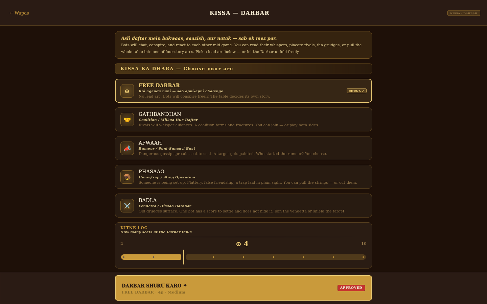

KISSA is the story-mode entry point to DARBAR. Pick a narrative arc to start with: run a Gathbandhan from turn one, or seed an Afwaah before the first GHOTALA. The bots have backstories and the table has a script. What you do with it is up to you.

---

## The ten personas

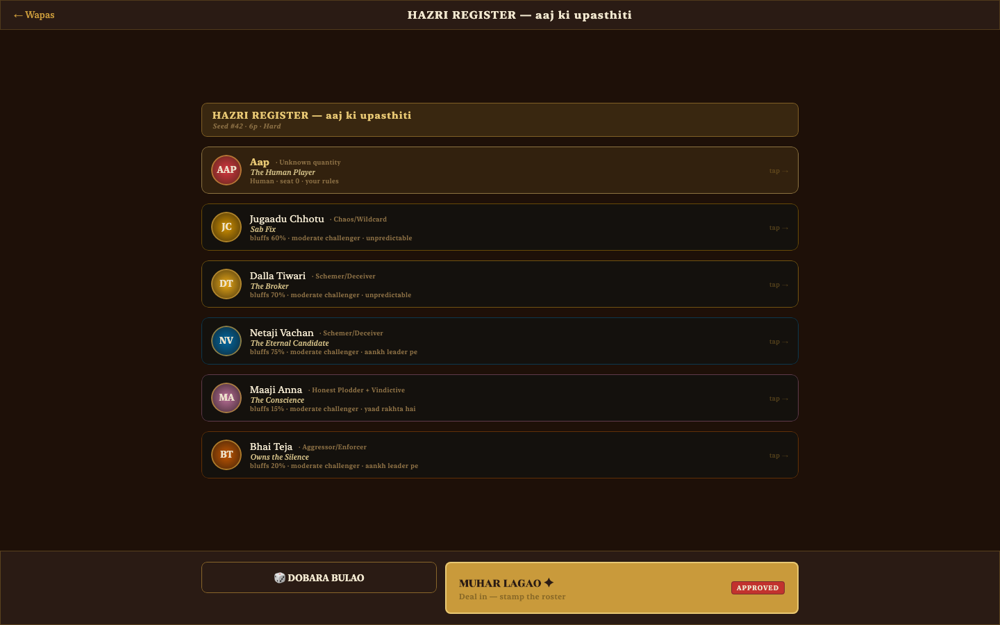

Ten bot personalities, assigned at match start by the **Hazri Register** (lobby). Each bluffs differently. Each has tells.

| Persona | Their thing |
|---------|-------------|
| **Netaji Vachan** | Claims his role even when holding someone else's card. Always has. Always will. Completely unbothered. |
| **Bhai Teja** | Goes silent before he strikes. The longer the pause between actions, the closer the Supari. |
| **Babu Filewala** | Taxis to DEHAADI obsessively — builds patiently, never exposes himself — until the moment he doesn't have to. |
| **Jugaadu Chhotu** | Does something unpredictable every time. Difficult to read because there is genuinely nothing to read. |
| **Vakil Loophole** | Challenges on principle. Every claim is suspicious. Every block is grounds for inquiry. |
| **Didi** | Vengeance is her love language. If you touch her, she follows through. No hurry. |
| **Madam Ji** | Always two moves ahead. Doesn't react — repositions. Never acts from emotion. |
| **Sharmaji's Son** | Learns nothing. Makes the same call every time. Infuriating if you expect any adaptation. |
| **Inspector Reddy** | By-the-book — for the right bribe. Claims blocking roles constantly. Procedure is leverage. |
| **Startup Bro** | Pivots every round. Each turn is a new grand strategy. Disrupts his own positions regularly. |

Each persona plays a statistically distinct policy. Didi's retaliation timing, Madam Ji's patience, Inspector Reddy's block-frequency — all measurable in the career head-to-head record.

---

## Decision Coach

The coach runs **ISMCTS** (Information Set Monte Carlo Tree Search) in the background — the same algorithm running the bots, turned toward advising you. It has only the information you have: the table-visible event log, standing claims, who got caught bluffing and when.

| Coach on your action — move starred, odds on claims | Opponent dossier — posterior + claim history | Bluff risk on your own action |
|:-:|:-:|:-:|
| 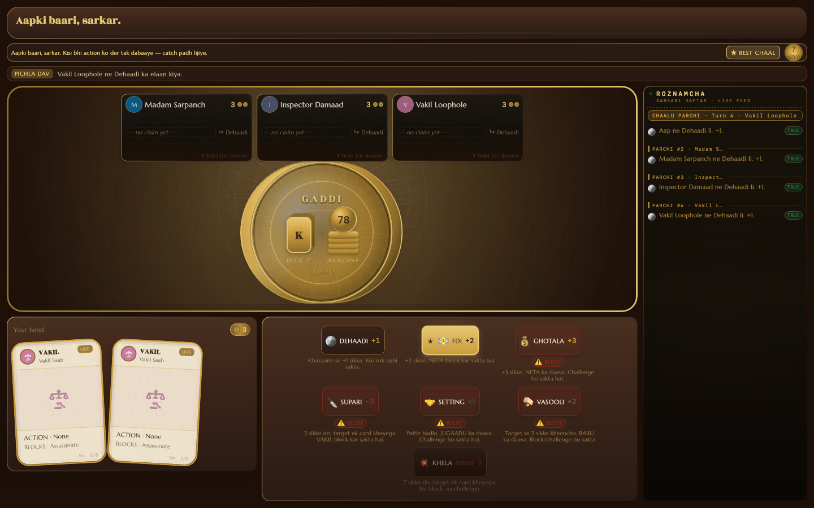 | 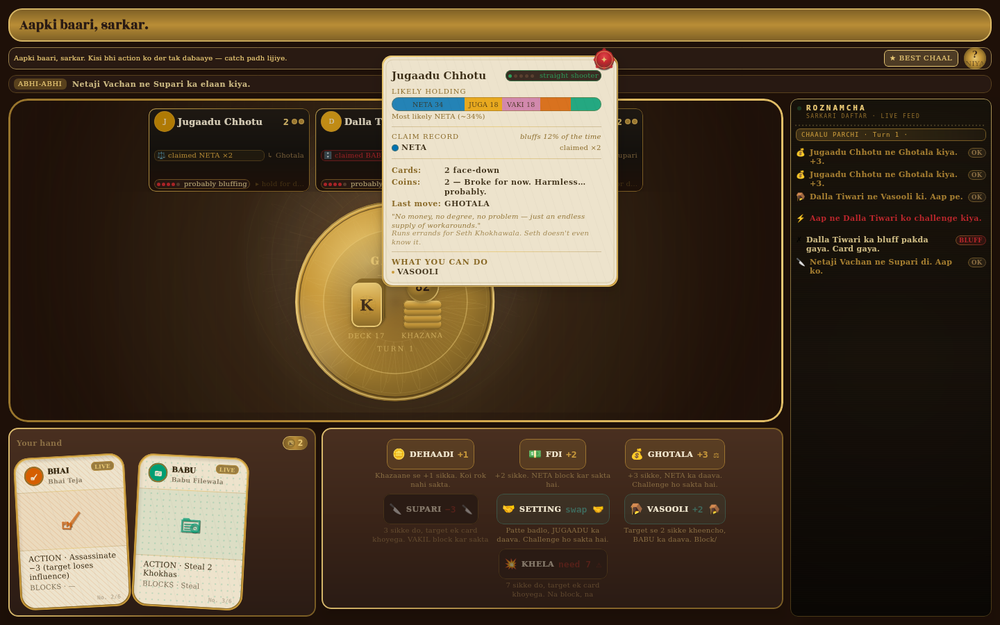 | 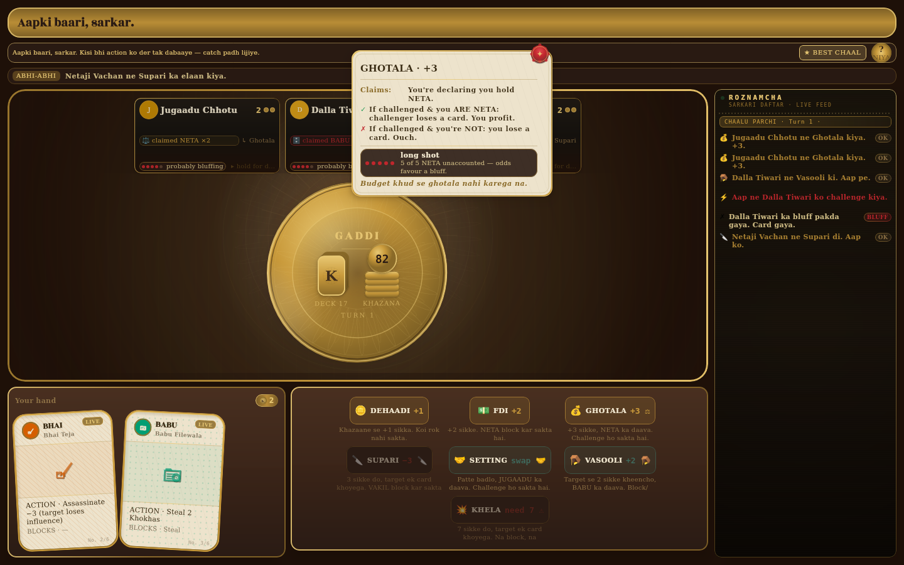 |

Every action chip gets annotated: the **recommended move** gets a brass star. Claim-bearing actions get a **REAL** or **BLUFF** badge and a **P(it flies)** odds pill. On the target-pick dock, the **weakest target** gets flagged.

Long-press an opponent's plate to open their **dossier chit**: posterior probability over their likely roles, all standing role claims, bluff-caught count, and inferred bluff rate — built from the public event record.

Long-press your pending action to open the **risk chit**: the probability your claim gets challenged, and the EV impact if it does.

| Coach on the reaction window | Coach off — play the table unaided | Rival claims visible on every plate |
|:-:|:-:|:-:|
| 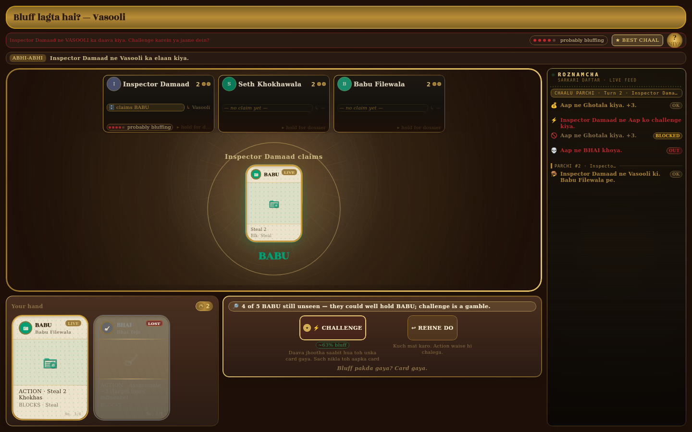 | 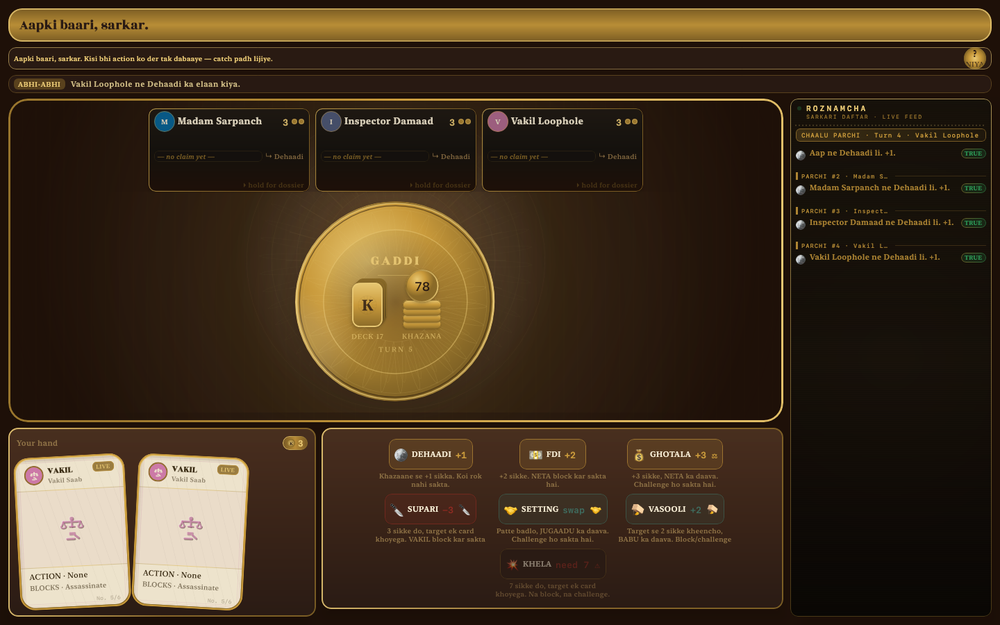 | 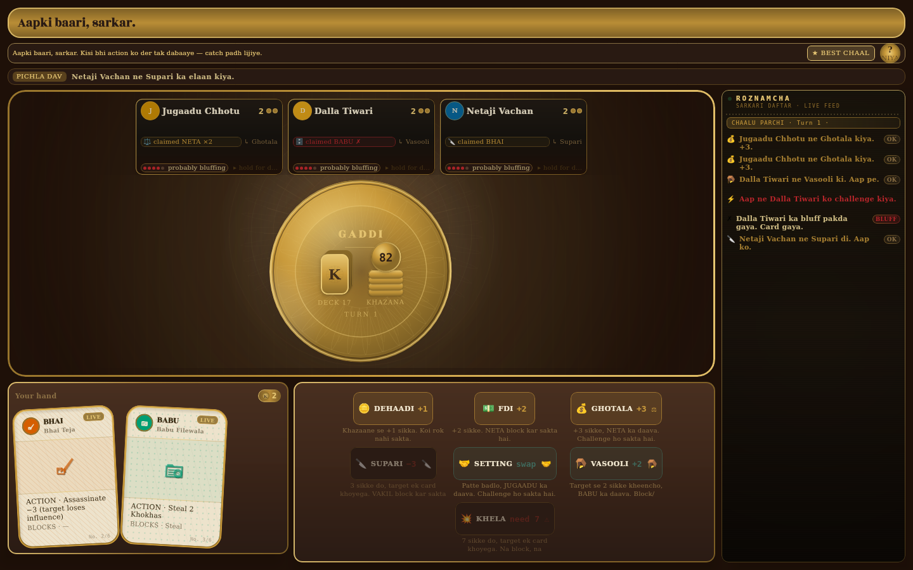 |

Coach can be toggled off in Settings. When off, the table is silent — no odds, no stars, no badges. All observational tools (dossier chit, risk chit, standing claims, suspicion pips, event log) remain visible regardless. Coach is advisory; the read is always yours.

---

## Game modes

### vs AI
1 human vs 1–9 bot opponents. Set player count, difficulty, and whether DARBAR is active.

**Difficulty levels:** Easy (scripted play-caller), Medium (ISMCTS 200 iterations), Hard (ISMCTS 2000 + coach-level search), Expert, Grandmaster.

---

### GAUNTLET — Tarakki ki Seedhi (Promotion Ladder)

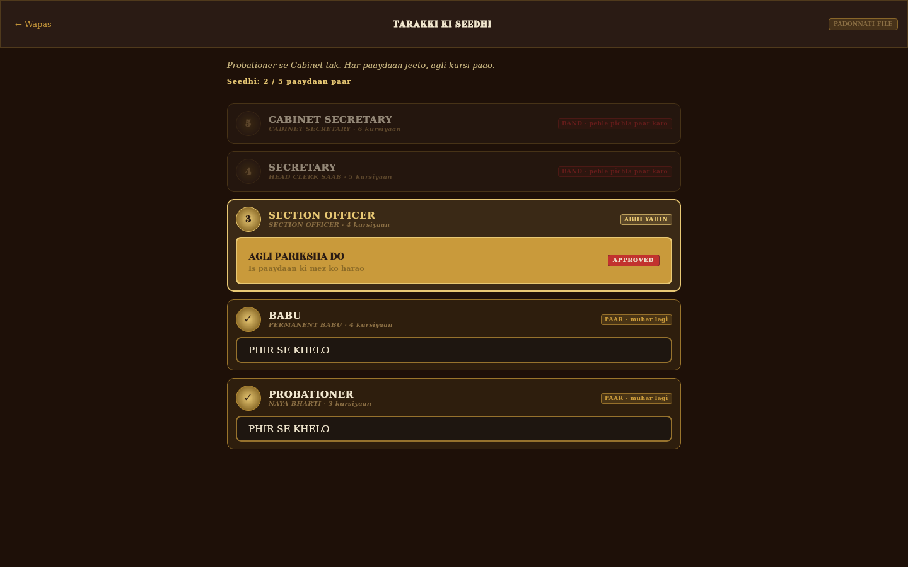

Five rungs. Win to climb. Lose and stay. You keep your rung — no snakes, no falls.

| Rung | Players | Difficulty |
|------|---------|------------|
| Rung 1 | 3p | Easy |
| Rung 2 | 3p | Medium |
| Rung 3 | 4p | Hard |
| Rung 4 | 5p | Expert |
| Rung 5 | 6p | Grandmaster |

Clear Rung 5 and the Gaddi is yours.

---

### Team Khel — Faction Play

| Team table — faction badges on the plates | Team Khel in Setup |
|:-:|:-:|
| 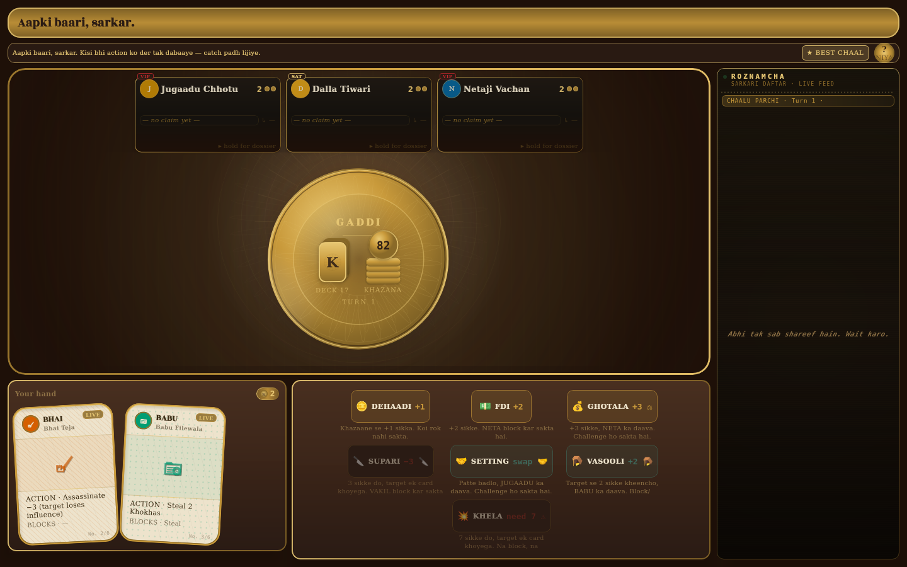 | 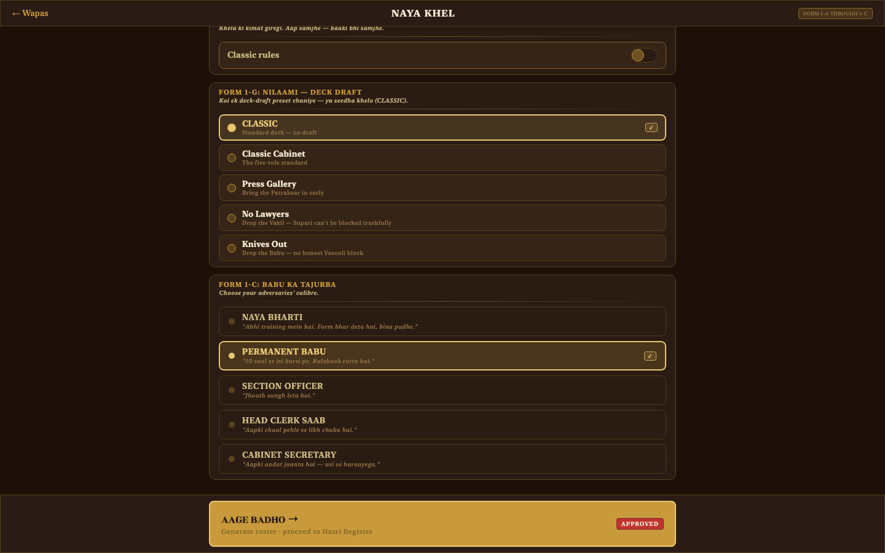 |

Two factions. **Allies are never legal targets** — engine rule, not convention. Targeting your own teammate is a structurally illegal move. Faction badges appear on every plate. Win as a team; the last surviving faction takes the table.

---

### DARBAR
The full social-layer mode: all four arcs active, bots chat, player suggestions live in the tray. Separate from ranked play — ranked runs the clean AI with no social layer; DARBAR is for narrative, story, and exhibition.

---

### TAMASHA — Watch Mode

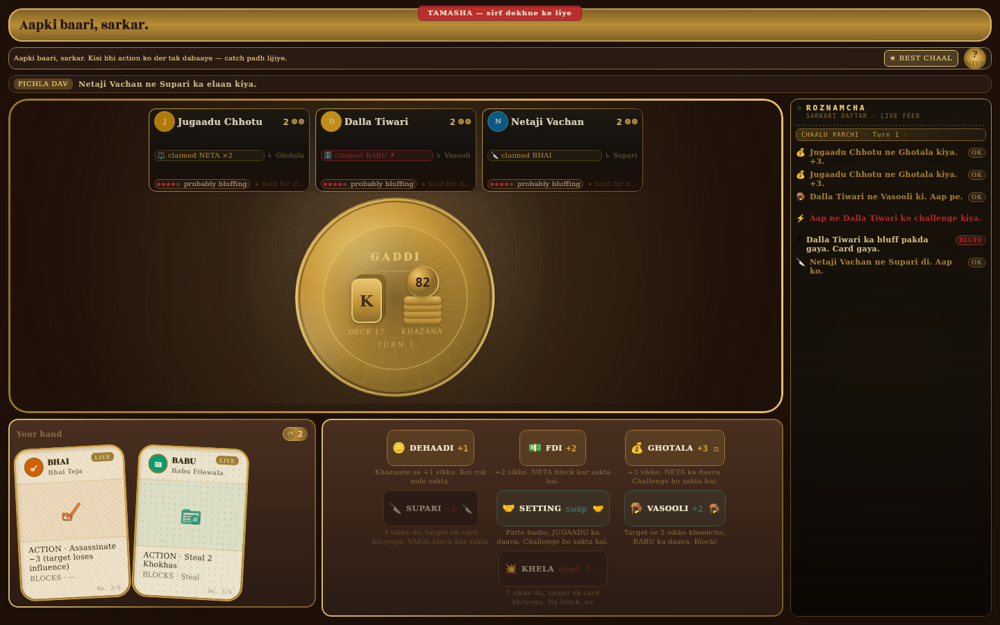

AI plays every seat. Spectator banner, no action controls. Watch ten personas destroy each other, form pacts, break them, and fight over the Gaddi. Good for a demonstration or for understanding how the personas read the table differently.

---

### Pass-and-play — Hot-seat Multiplayer

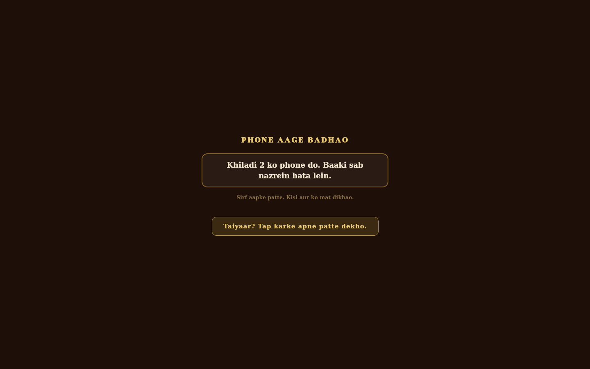

Multiple humans, one device. After each turn, a **handoff guard** blanks the screen and prompts the next player to take the device — so face-down cards stay hidden between turns. No accounts, no network required.

---

### 2–10 players

| 2-player duel | 10-player table |
|:-:|:-:|
|  | 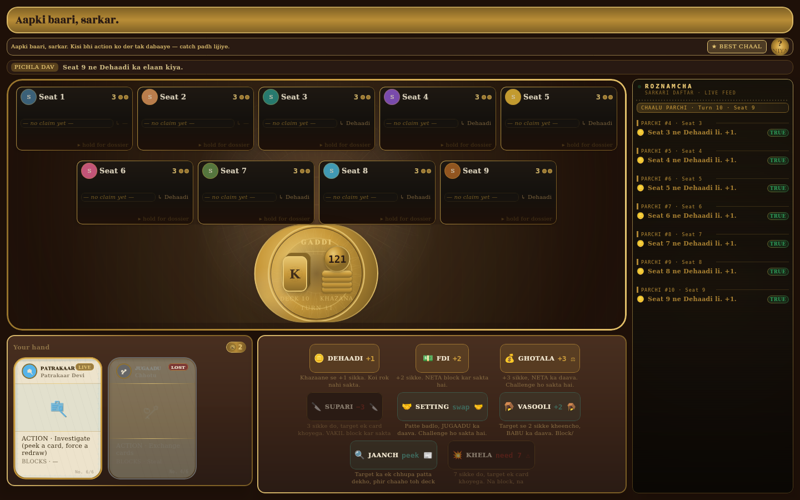 |

At 2 players, SUPARI + KHELA dynamics dominate — the coin race is fast. At 10 players, the PATRAKAAR (6th role) enters the deck; the Jaanch information-asymmetry and the social layer make the table genuinely loud.

---

## Career, replay, and ranking

### Results certificate


After every game: a stamped certificate. Winner, final standings, bluffs held, bluffs caught, and a **decision-quality recap** — how closely your moves matched the ISMCTS best-move at each decision point, average EV bled, and challenge accuracy. Share it directly.

---

### Roznamcha — Career Dossier

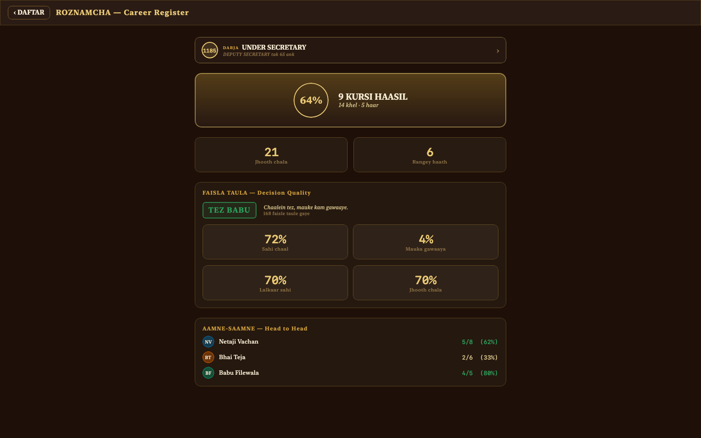

Lifetime stats: games, wins, bluffs held, bluffs caught. Head-to-head records against each bot persona — who you've played, and who you've beaten. A **decision-quality ledger** that accumulates across all games: accuracy against ISMCTS best-move, average EV bled per decision, challenge accuracy %, bluff success rate.

---

### Darja-suchi — Local Ranking

| Local ELO with spark-line | Online standings connected |
|:-:|:-:|
| 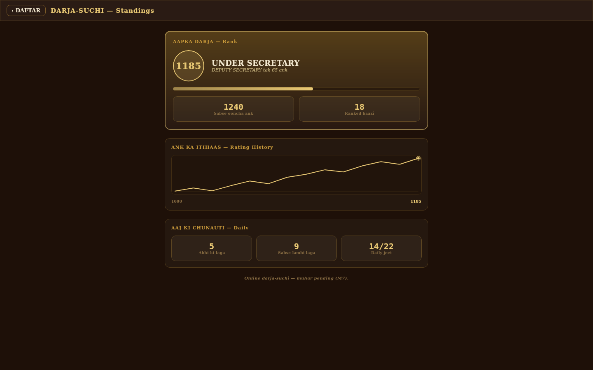 |  |

Local ELO with a 14-game rating history spark-line. Daily challenge (Aaj ki Chunauti) that resets each day. Streak counter with best-streak history. When connected to the Ktor server, an **online standings board** appears alongside local — server-backed real-time rankings.

---

### Replay Scrubber

| Replay with advisor annotation | Recent matches list |
|:-:|:-:|
| 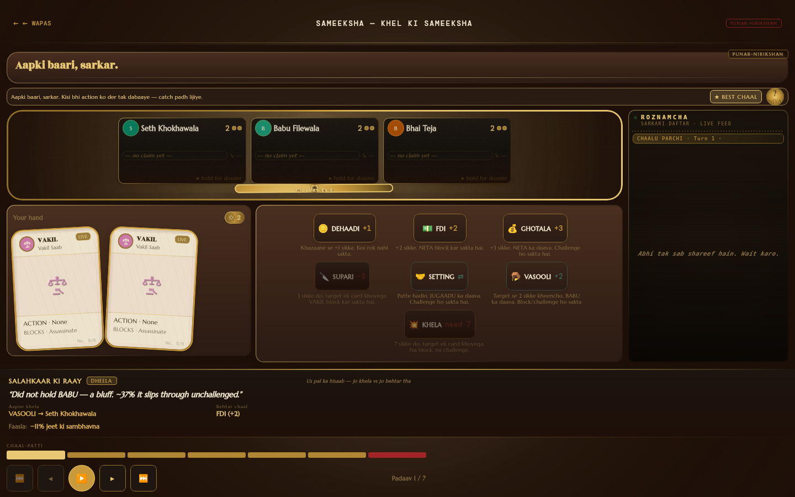 | 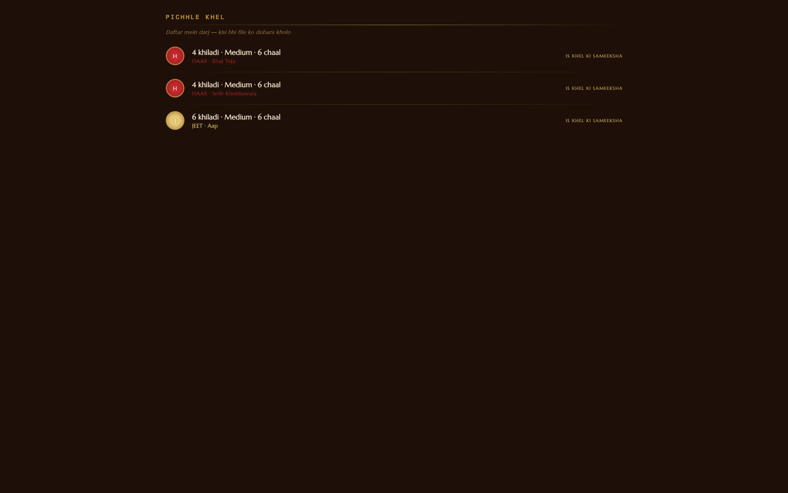 |

Every completed match is stored as `(seed, intentLog)`. The replay reconstructs the game state **byte-for-byte** from that pair — no snapshots required. Step through each decision. At annotated moments, see what the coach would have recommended and how your move compared. Available from the career screen for recent matches.

---

## Online play

| Online hub — mode picker | LAN browse — discovered hosts | Waiting room — code + seats |
|:-:|:-:|:-:|
| 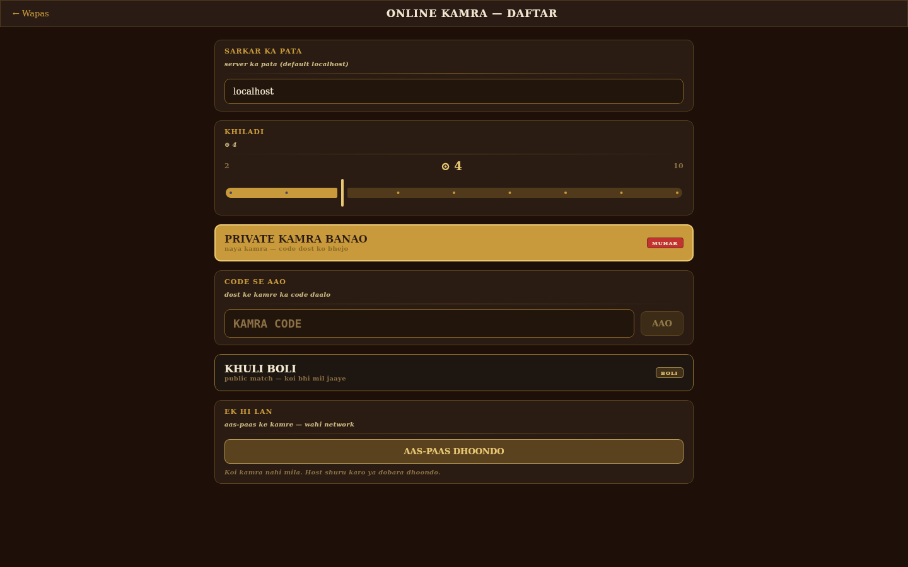 | 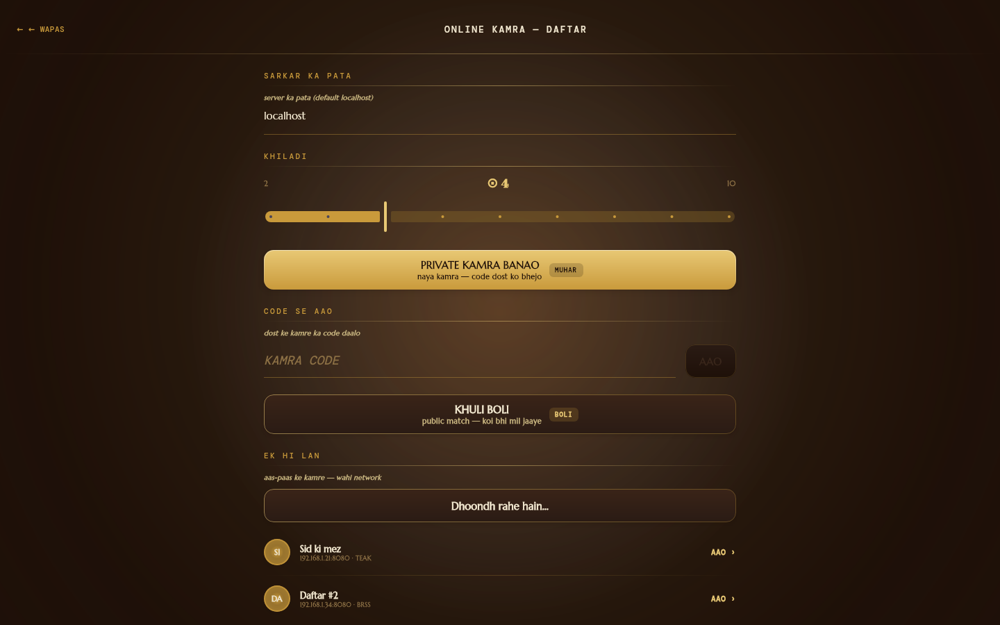 | 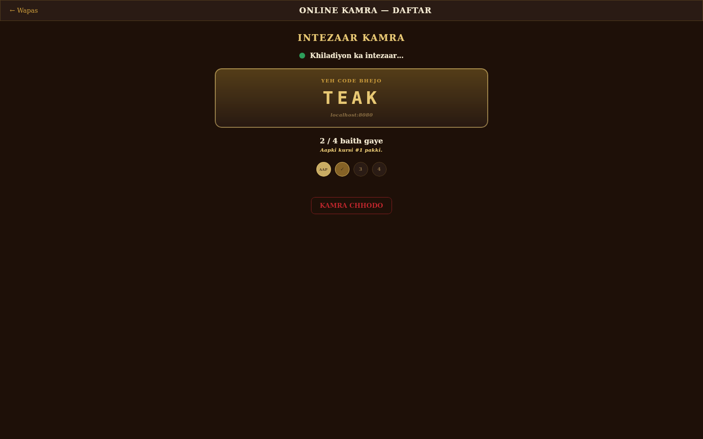 |

**Private room by code** — create a room, share the 4-letter code. Anyone with the code joins.

**Quick-match** — matchmake against whoever is waiting.

**LAN discovery** — Bonjour/mDNS browse shows all Kursi games on the local network. No manual IP entry.

The authoritative server is **Ktor/Netty**. All game state lives server-side. Clients receive only their redacted `PlayerView` — the server never sends information a player shouldn't have. A disconnected player auto-passes on their turn until they reconnect.

| Connection dropped — reconnect banner |
|:-:|
| 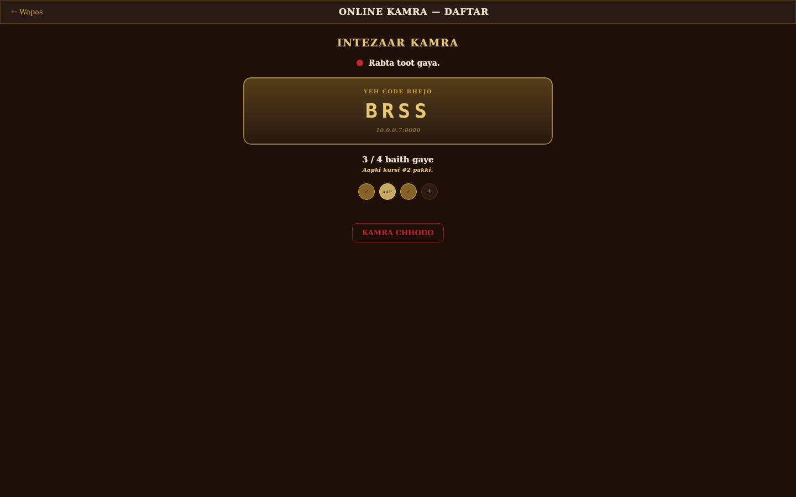 |

---

## Onboarding

### Pehli Hazri — Interactive Tutorial

| Intro — the scripted table | Beat 7 — bluff caught, JHOOTH stamp |
|:-:|:-:|
| 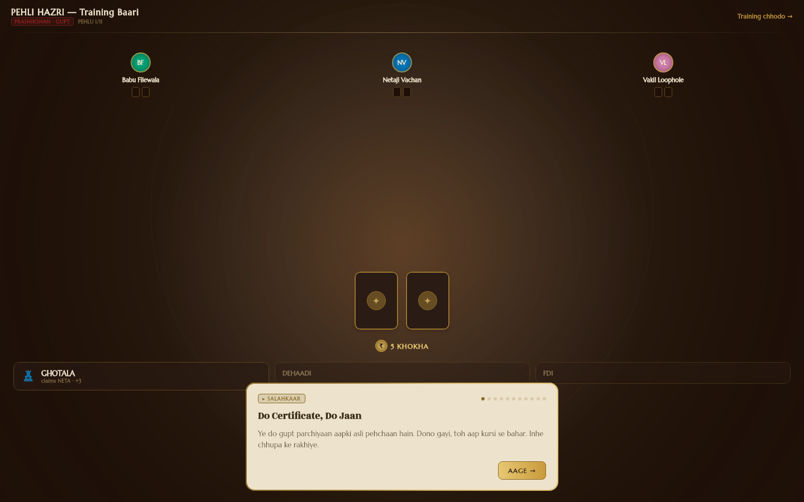 | 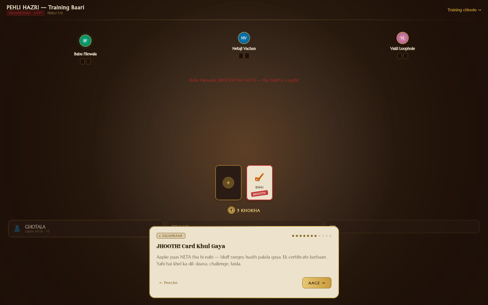 |

Scripted table with guaranteed teaching beats. Beat 7 is the lesson that matters: a NETA claim gets challenged and the card flips to BHAI. The **JHOOTH** (liar) verdict stamp lands. The bluffer loses influence. You can't exit the tutorial without seeing it happen.

---

### Setup

| Setup screen | Setup with Team Khel toggle |
|:-:|:-:|
| 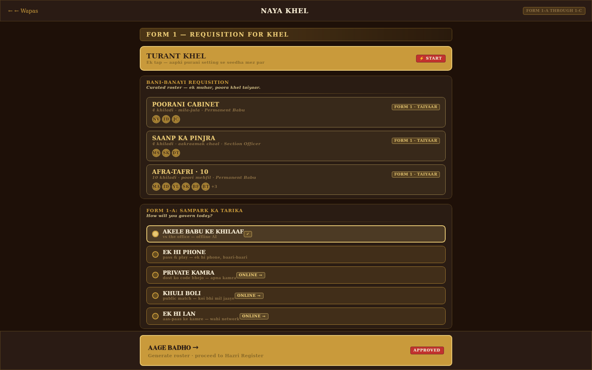 |  |

Set player count (2–10), difficulty, play mode (vs AI / DARBAR / TAMASHA / Pass-and-play), and whether Team Khel is active. Team Khel appears when 4+ players are selected and is the only option that restructures the engine-level legality of targets.

---

### Niyam Gazette — Rule Reference


Pull up mid-game without leaving the table. Three tabs: roles and their powers, all actions with coin costs, and the DARBAR arc reference. Includes PATRAKAAR when the 6th role is in play.

---

## Reduced-motion and accessibility

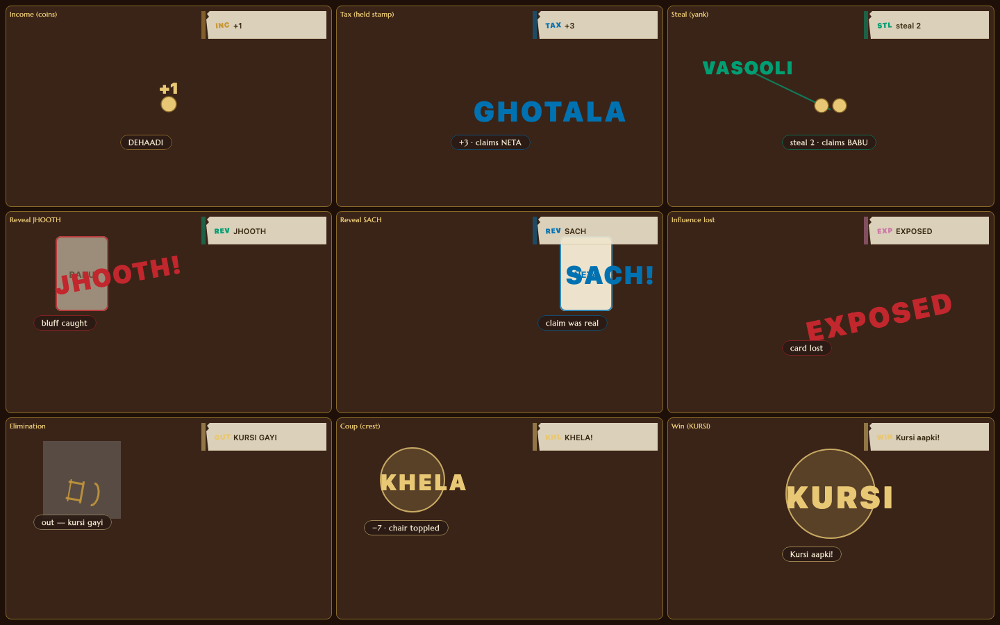

Every game moment (income, coin steal, role reveal, influence loss, elimination, coup, win) has a **tailored static end-frame** when reduced motion is on — not a generic fade. GHOTALA shows a held stamp. SUPARI shows the tipped chair. KHELA shows the KURSI crest. Okabe-Ito CVD-safe palette for all role colours. Full VoiceOver/TalkBack support with semantic properties and traversal order.

---

## Architecture

```
Kursi/
├── engine/           # (GameState, Intent) → GameState — zero deps, RNG in state
├── ai/               # ISMCTS + 10 personas + social model + cloud/on-device LLM layer
├── server/           # Ktor/Netty authoritative server
├── shared-protocol/  # Wire types (server ↔ client)
├── core/
│   ├── designsystem/ # KursiTheme, RoleGlyph, all UI primitives
│   ├── prefs/        # Career stats, gauntlet progress, resume snapshot, API key store
│   ├── network/      # Ktor WS client + LAN discovery
│   └── feedback/     # Haptics, notification channels, share sheet (expect/actual)
├── feature/game/     # GameScreen, GameViewModel, GameSession, DARBAR narrative engine
├── cmp-shared/       # NavHost + all screens (shared Compose UI)
├── cmp-android/      # Android shell — FCM, adaptive icons, in-app review/update
├── cmp-ios/          # iOS KMP framework — APNs, StoreKit review, App Store update check
├── cmp-desktop/      # JVM desktop + headless render harness
└── cmp-web/          # Kotlin/Wasm browser + PWA manifest
```

Things worth calling out:

**Engine is a pure function.** `(GameState, Intent) → GameState` with a counter-based SplitMix64 RNG carried in state. No `Date.now()`, no global random. Any game replays byte-for-byte from `(seed, intentLog)`. Resume, replay, and server authority all work without snapshots — `MatchResumeTest` proves this.

**Secrecy boundary is structural, not convention.** `redact(state, viewer) → PlayerView` is a type-level projection. Another player's face-down roles cannot structurally appear in the view. Bots only see their `PlayerView` — engine-level cheating is impossible by construction, not policy.

**DARBAR narrative doesn't touch the engine.** Two RNG streams: `nudgeRng` advances in strict bot-step order (deterministic across resume) and a cosmetic `rng` for chat timings (never game-affecting). `NarrativeResumeTest` covers this.

**Design system is the enforcement layer.** Every surface routes through `BrassParchmentSurface`, `decoPopoverPaper`, `WaxSeal`, `drawRoleGlyph`. The License Raj Deco visual identity — 1950s–70s government-issue document aesthetic, teak `#1A1A2E` / brass `#C99A3B` / cream `#F4ECD8` — is structurally enforced, not left to per-screen taste.

**AI layer is provider-agnostic.** The `AiProvider` interface abstracts Anthropic, OpenAI, and Gemini cloud calls, on-device Gemini Nano (Android), and Apple FoundationModels (iOS 26). ISMCTS is the offline fallback. BYOK (bring your own key) stored in EncryptedSharedPreferences / Keychain.

---

## Getting started

```bash
git clone https://github.com/darkpandawarrior/Kursi.git
cd Kursi

# Fastest path to the full game
./gradlew :cmp-desktop:run

# Android
./gradlew :cmp-android:assembleDebug
adb install -r cmp-android/build/outputs/apk/debug/kursi-debug-1.0.0.apk

# All JVM tests
./gradlew jvmTest

# Render screen fixtures (no device needed)
./gradlew :cmp-desktop:renderScreens
```

Signing: `cp keystore.properties.template keystore.properties` and fill in your keystore.

Version bump: `scripts/bump_version.sh --patch|--minor|--major`

---

## Build targets

| Command | Output |
|---------|--------|
| `:cmp-android:assembleDebug` | `kursi-debug-{version}.apk` |
| `:cmp-android:bundleRelease` | `.aab` for Play Store |
| `:cmp-desktop:run` | Launch desktop app |
| `:cmp-desktop:packageDistributionForCurrentOS` | `.dmg` / `.deb` / `.exe` |
| `:cmp-web:wasmJsBrowserDistribution` | Wasm browser build |
| `:cmp-ios:linkReleaseFrameworkIosArm64` | `KursiKit.framework` |
| `make all` | All targets into `outputs/` |

Fastlane:

```bash
bundle install
bundle exec fastlane android internal
bundle exec fastlane ios testflight
```

---

## Docs

- [Game rules PDF](docs/Kursi_Game_Rules-v2.pdf)
- [Visual identity guide](docs/brand/BRAND.md)

---

## Tech

Kotlin Multiplatform 2.4 · Compose Multiplatform 1.11 · Ktor 3.5 · multiplatform-settings 1.3 · kotlinx.serialization 1.11 · detekt · ktlint · Fastlane · GitHub Actions

---

## License

CC BY-NC-SA 4.0 — source is available for study; commercial use needs permission. Copyright (c) 2025–2026 Siddharth Pandalai.

Inspired by *Coup* (Rikki Tahta, Indie Boards and Cards, 2012). Game mechanics are uncopyrightable; all original expression is wholly original. See [LICENSE](LICENSE) and [NOTICE](NOTICE).

*सारे पात्र काल्पनिक हैं।*  
All characters and events are fictional. Satire only.
