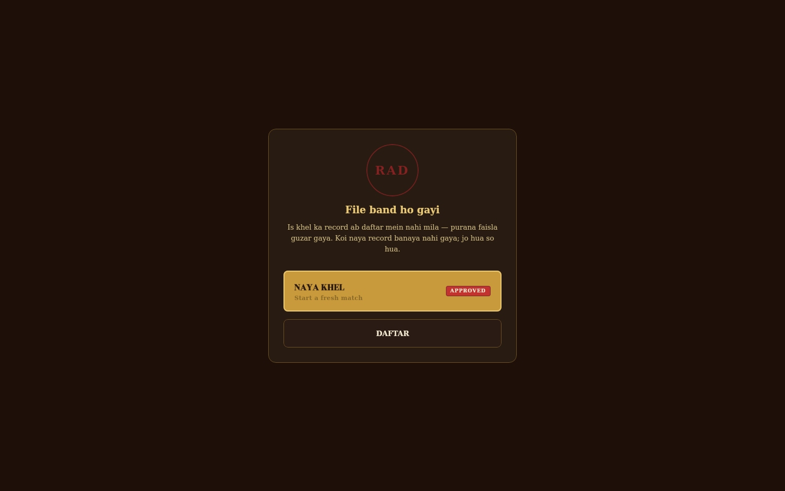

<div align="center">

# Kursi

*Kursi ke liye kuch bhi karega.*

[](https://github.com/darkpandawarrior/Kursi/actions/workflows/ci.yml)
[](https://github.com/darkpandawarrior/Kursi/actions/workflows/quality.yml)


[](LICENSE)

</div>

Bluffing card game set in a satirical India corporate-political underworld. Five roles — Netaji who believes his own lies, Bhai who owns the silence, Babu who approves nothing, Jugaadu with solutions mostly illegal, Vakil who has read every rule twice. Everyone at the table is corrupt. The game decides by how much.

Inspired by Coup (Indie Boards and Cards, 2012). Theme, characters, code, visuals — all original.

Built in Kotlin Multiplatform. One codebase, four targets: Android, iOS, JVM desktop, Kotlin/Wasm.

---

## Screenshots

**DARBAR** — bots form alliances, spread rumours, hold grudges. The Afwaah arc is live: the table has piled on Babu, and the player can fuel it or flip the narrative.


---

### Core gameplay

| Your turn — pick an action | Claim + coach odds | Block or let it pass? |
|:-:|:-:|:-:|
|  |  |  |

| Block step — safe vs risky | Exchange — keep your roles | Influence lost |
|:-:|:-:|:-:|
|  |  |  |

---

### Decision Coach

The coach runs ISMCTS in the background and annotates every chip — recommended move starred, bluff odds on every claim, weakest target on the board marked.

| Coach on the action dock | Opponent dossier — posterior + claims | Bluff risk on your action |
|:-:|:-:|:-:|
|  |  |  |

| Coach on the reaction window | Coach off — play unaided | Rival claims live on the plate |
|:-:|:-:|:-:|
|  |  |  |

---

### Game modes

| GAUNTLET — promotion ladder | Team Khel — faction table | TAMASHA — spectator / demo |
|:-:|:-:|:-:|
|  |  |  |

| 2-player duel | 10-player table | Pick your target |
|:-:|:-:|:-:|
|  |  |  |

---

### DARBAR story arcs

| KISSA — story mode hub | Game over | Pass-and-play handoff |
|:-:|:-:|:-:|
|  |  |  |

---

### Career, replay, and ranking

| Results certificate + share | Roznamcha — career dossier | Darja-suchi — local ranking |
|:-:|:-:|:-:|
|  |  |  |

| Online standings | Replay scrubber + advisor | Recent matches list |
|:-:|:-:|:-:|
|  |  |  |

---

### Online & lobby

| Online hub — modes | LAN browse | Waiting room |
|:-:|:-:|:-:|
|  |  |  |

| Connection lost — reconnecting | Hazri register — bot roster | Results expired state |
|:-:|:-:|:-:|
|  |  |  |

---

### Onboarding & settings

| Home | Home with rank strip + daily | Tutorial — Pehli Hazri intro |
|:-:|:-:|:-:|
|  |  |  |

| Bluff caught — teaching moment | Setup | Setup with Team Khel |
|:-:|:-:|:-:|
|  |  |  |

| Niyam Gazette — role reference | Settings | Reduced-motion frames |
|:-:|:-:|:-:|
|  |  |  |

---

## The game

On your turn, claim any role — whether you hold it or not. Someone can call your bluff. If they're right, you flip and lose influence. If they're wrong, they lose influence. At 10 coins you must Khela (Coup). Last player with influence wins the Gaddi.

| Role | Character | Action | Block |
|------|-----------|--------|-------|
| Neta | Netaji Dhanpat Rai Vachan | FDI +3 coins | Foreign Aid |
| Bhai | Bhai Teja | Supari — assassinate for 3 | Supari |
| Babu | Babu Filewala | Tax +3 | Vasooli |
| Jugaadu | Jugaadu Chhotu | Vasooli — steal 2 | — |
| Vakil | Vakil Loophole | Suraksha — block Supari | Supari |

### Modes

- **vs AI** — 1 human vs 1–9 bots
- **GAUNTLET** (Tarakki ki Seedhi) — 5-rung escalating ladder, Easy/3p through Grandmaster/6p
- **Team Khel** — faction play; allies are never legal targets
- **DARBAR** — bots chat, form alliances, spread rumours, hold grudges. You can manipulate them.
- **TAMASHA** — AI plays all seats. Watch the chaos.

### DARBAR arcs

Bots aren't just difficulty levels. They have personalities and they talk. Four arcs play out during games:

- **Gathbandhan** — two bots agree to not target each other. Until one defects.
- **Afwaah** — a rumour about someone's role spreads through the table. Might be true.
- **Sting** — a bot "leaks" a real card claim. Now everyone is watching.
- **Badla** — a bot you hit declares a grudge, and follows through on it.

---

## Architecture

```
Kursi/
├── engine/           # (GameState, Intent) → GameState — zero deps, RNG in state
├── ai/               # ISMCTS + 10 personas + social model
├── server/           # Ktor/Netty authoritative server
├── shared-protocol/  # Wire types (server ↔ client)
├── core/
│   ├── designsystem/ # KursiTheme, RoleGlyph, all UI primitives
│   ├── prefs/        # Career stats, gauntlet progress, resume snapshot
│   ├── network/      # Ktor WS client + LAN discovery
│   └── feedback/     # Haptics + audio (expect/actual per platform)
├── feature/game/     # GameScreen, GameViewModel, GameSession, DARBAR
├── cmp-shared/       # NavHost + all screens (shared Compose UI)
├── cmp-android/      # Android shell
├── cmp-ios/          # iOS framework
├── cmp-desktop/      # JVM desktop + render harness
└── cmp-web/          # Kotlin/Wasm browser
```

Things worth calling out:

**Engine is a pure function.** `(GameState, Intent) → GameState` with a counter-based SplitMix64 RNG carried in state. No `Date.now()`, no global random. Any game replays byte-for-byte from `(seed, intentLog)`. Resume, replay, and server authority all work without snapshots — `MatchResumeTest` proves this.

**Secrecy boundary is structural, not convention.** `redact(state, viewer) → PlayerView` is a type-level projection. Another player's face-down roles cannot structurally appear in the view. Bots only see their `PlayerView` — engine-level cheating is impossible by construction, not policy.

**DARBAR narrative doesn't touch the engine.** Two RNG streams: `nudgeRng` advances in strict bot-step order (deterministic across resume) and a cosmetic `rng` for chat timings (never game-affecting). `NarrativeResumeTest` covers this.

**Design system is the enforcement layer.** Every surface routes through `BrassParchmentSurface`, `decoPopoverPaper`, `WaxSeal`, `drawRoleGlyph`. The License Raj Deco visual identity — 1950s–70s government-issue document aesthetic, teak/brass/cream — is structurally enforced.

---

## Getting started

```bash
git clone https://github.com/darkpandawarrior/Kursi.git
cd Kursi

# Fastest path to the full game
./gradlew :cmp-desktop:run

# Android
./gradlew :cmp-android:assembleDebug
adb install -r cmp-android/build/outputs/apk/debug/kursi-debug-1.0.0.apk

# All JVM tests
./gradlew jvmTest

# Render screen fixtures (no device needed)
./gradlew :cmp-desktop:renderScreens
```

Signing: `cp keystore.properties.template keystore.properties` and fill in your keystore.

Version bump: `scripts/bump_version.sh --patch|--minor|--major`

---

## Build targets

| Command | Output |
|---------|--------|
| `:cmp-android:assembleDebug` | `kursi-debug-{version}.apk` |
| `:cmp-android:bundleRelease` | `.aab` for Play Store |
| `:cmp-desktop:run` | Launch desktop app |
| `:cmp-desktop:packageDistributionForCurrentOS` | `.dmg` / `.deb` / `.exe` |
| `:cmp-web:wasmJsBrowserDistribution` | Wasm browser build |
| `:cmp-ios:linkReleaseFrameworkIosArm64` | `KursiKit.framework` |
| `make all` | All targets into `outputs/` |

Fastlane:

```bash
bundle install
bundle exec fastlane android internal
bundle exec fastlane ios testflight
```

---

## Docs

- [Game rules PDF](docs/Kursi_Game_Rules-v2.pdf)
- [Visual identity guide](docs/brand/BRAND.md)

---

## Tech

Kotlin Multiplatform 2.4 · Compose Multiplatform 1.11 · Ktor 3.5 · multiplatform-settings 1.3 · kotlinx.serialization 1.11 · detekt · ktlint · Fastlane · GitHub Actions

---

## License

CC BY-NC-SA 4.0 — source is available for study; commercial use needs permission. Copyright (c) 2025–2026 Siddharth Pandalai.

Inspired by *Coup* (Rikki Tahta, Indie Boards and Cards, 2012). Game mechanics are uncopyrightable; all original expression is wholly original. See [LICENSE](LICENSE) and [NOTICE](NOTICE).

*सारे पात्र काल्पनिक हैं।*
