<div align="center">

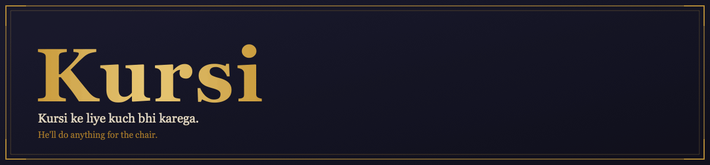

### Kursi ke liye kuch bhi karega — he'll do anything for the chair.

A bluffing card game set in a satirical India corporate-political underworld — 2–10 players, five
roles hidden face-down, everyone lying about what they hold. Built in Kotlin Multiplatform with
Compose Multiplatform: one codebase, four targets. Coup's deterministic bluffing core, plus a bot
social layer (DARBAR) and an ISMCTS-powered coach on top.

[](https://github.com/darkpandawarrior/Kursi/actions/workflows/ci.yml)
[](https://github.com/darkpandawarrior/Kursi/actions/workflows/quality.yml)


[](LICENSE)


**[Why](#why-kursi)** · **[Highlights](#highlights)** · **[Screenshots](#screenshots)** · **[Features](#features-at-a-glance)** · **[Architecture](#architecture)** · **[Tech stack](#tech)** · **[Getting started](#getting-started)** · **[Roadmap](#roadmap)**

Sibling repos: [`kmp-toolkit`](https://github.com/darkpandawarrior/kmp-toolkit) (vendored `mvi-core`/`feedback`/`common`/`bots-policy`/`network`/`ai`/`llm-chat`) · [`kmp-build-logic`](https://github.com/darkpandawarrior/kmp-build-logic) (shared Gradle convention plugins) · Portfolio: [cv-siddharth.vercel.app](https://cv-siddharth.vercel.app/)

</div>

---

<details>
<summary><b>Table of contents</b></summary>

- [Why Kursi](#why-kursi)
- [Highlights](#highlights)
- [Screenshots](#screenshots)
- [The three-layer table — FOCUS / GUIDED / ANALYST](#the-three-layer-table--focus--guided--analyst)
- [Sarkari Noir — the AAA visual system](#sarkari-noir--the-aaa-visual-system)
- [The world](#the-world)
- [Home](#home)
- [The six roles](#the-six-roles)
- [How you play](#how-you-play)
- [DARBAR — the social layer](#darbar--the-social-layer)
- [KISSA — story arcs mode](#kissa--story-arcs-mode)
- [The ten personas](#the-ten-personas)
- [Decision Coach](#decision-coach)
- [The Munshi — AI narrator](#the-munshi--ai-narrator)
- [Game modes](#game-modes)
- [Career, replay, and ranking](#career-replay-and-ranking)
- [Online play](#online-play)
- [Onboarding](#onboarding)
- [Reference & accessibility](#reference--accessibility)
- [Shader material layer & sound](#shader-material-layer--sound)
- [Features at a glance](#features-at-a-glance)
- [Architecture](#architecture)
- [Technical deep dive](#technical-deep-dive)
- [Getting started](#getting-started)
- [Build targets](#build-targets)
- [Roadmap](#roadmap)
- [Docs](#docs)
- [Tech](#tech)
- [License](#license)

</details>

> **At a glance** — **13-module** Kotlin Multiplatform architecture (`engine` · `ai` ·
> `shared-protocol` · `core:designsystem`/`network`/`prefs` · `feature:game` · 4 app shells ·
> `server`), 10 bot personas, 4 concurrent DARBAR story arcs, one vendored `kmp-toolkit` submodule
> for `mvi-core`/`feedback`/`common`/`bots-policy`/`network`/`ai`/`llm-chat`. *Module list from
> `settings.gradle.kts`.*

## Why Kursi

Coup (Indie Boards and Cards, 2012) is a tight bluffing game with almost no social layer — five roles, a handful of actions, and the table goes quiet between claims. Kursi keeps that deterministic core intact and builds a satirical India corporate-political skin plus a social layer (DARBAR) on top of it: bots that remember, gossip, form pacts and hold grudges, and an ISMCTS-powered coach that reads the table the way the bots do.

The first build of that idea shipped every screen as one dense instrument panel — right for a rules-lawyer, overwhelming for a first-timer. The overhaul in this README's screenshots is the fix: the same engine, the same DARBAR layer, now revealed at **three densities** instead of one, wrapped in a from-scratch **AAA visual language** and narrated in-character by an **AI Munshi** instead of static log lines. Nothing about the deterministic core changed — the presentation layer got rebuilt around how a new player actually learns the table.

It's also the KMP proving ground for reusable pieces that live in a separate repo: `mvi-core`, `feedback` and several other shared modules (`common`, `bots-policy`, `network`, the on-device-AI layer, `llm-chat`) are versioned once in [`kmp-toolkit`](https://github.com/darkpandawarrior/kmp-toolkit) and consumed here via `includeBuild` + dependency substitution, not copy-pasted — the same toolkit and the same [`kmp-build-logic`](https://github.com/darkpandawarrior/kmp-build-logic) convention plugins that back [Mileway](https://github.com/darkpandawarrior/Mileway) and [PaymentsLab](https://github.com/darkpandawarrior/PaymentsLab), the sibling projects under the same [portfolio](https://cv-siddharth.vercel.app/). See [Technical deep dive](#technical-deep-dive) for exactly how.

What's real vs. mocked, honestly:
- **Engine, AI (ISMCTS), DARBAR, career/replay, offline modes** — fully implemented, covered by `commonTest` (`ScalingGoldenTest`, `MatchResumeTest`, `NarrativeResumeTest`).
- **The FOCUS/GUIDED/ANALYST density layers, the Sarkari Noir visual system, beat-gate pacing** — fully implemented across every screen, covered by `feature:game` / `core:designsystem` unit tests and the render-fixture gate below.
- **The Munshi AI narrator** — a real seam (`MunshiNarrator`, provider matrix: on-device → BYOK cloud → templated floor); the templated tier is always live, on-device/cloud upgrade it in place when a provider is available.
- **The AGSL/Skia shader material layer** — real `RuntimeShader`/`RuntimeEffect` per-platform actuals with a procedural (non-shader) fallback where the platform doesn't support runtime shaders.
- **Online play (Ktor/Netty server, LAN discovery, reconnect)** — real server code and protocol, not a mock; gameplay-tested locally. Production deploy (`server-deploy.yml` → Fly.io) is wired but not yet running continuously.
- **Cloud AI providers (Anthropic/OpenAI/Gemini)** — real `AiProvider` implementations, BYOK. On-device Gemini Nano / Apple FoundationModels are the no-network fallback path.
- **Store distribution pipelines** (Play, F-Droid, Amazon, Huawei, Samsung, Aptoide) — real workflows, gated on repo secrets that aren't populated yet; no build has shipped to a store.

Inspired by Coup (Indie Boards and Cards, 2012). Theme, characters, code, visuals — all wholly original.

## Highlights

- 🎚️ **Three densities, one engine.** FOCUS (turn · one plain sentence · your hand · your actions, nothing else) → GUIDED (FOCUS + one suggestion at a time) → ANALYST (the full instrument panel). A pure function (`evaluateDensityGraduation`) climbs a player FOCUS → GUIDED → ANALYST as they rack up completed matches, climbing faster if their lifetime decision-quality reads competent — and never overrides a manual choice in Settings.
- 🎨 **Sarkari Noir — an AAA visual system, not a reskin.** One warm-lamp-on-teak/brass/paper material language enforced across every screen: no bordered boxes (shadow + material only), raised "stamp" buttons, brass-rimmed tokens, engraved DM Mono/Rozha One/Marcellus headers, one accent colour (oxblood) reserved for the thing that actually needs it. Spelled out in [`docs/design-language.md`](docs/design-language.md).
- 🗞️ **The Munshi — an AI narrator, not a log.** `MunshiNarrator` turns the redacted table state + recent events into one grounded, in-character sentence, upgrading the templated headline in place. Provider matrix: on-device (auto-detected, zero setup) → any BYOK cloud provider you opt into → the templated floor, which is always truthful and never blocks a beat.
- ⏸️ **Beat-gate pacing.** In FOCUS/GUIDED, the table holds on a meaningful beat until you tap, click, or press Space to continue — instead of the log auto-scrolling past what just happened.
- 🎲 **Deterministic engine, unchanged underneath.** `(GameState, Intent) → GameState`, a pure function with a counter-based SplitMix64 RNG carried in state — no wall-clock, no platform `Random`. Any match replays byte-for-byte from `(seed, intentLog)`.
- 🕵️ **Structural secrecy, not convention.** `redact(state, viewer) → PlayerView` is a type-level projection — another player's face-down roles cannot structurally appear in the view bots or clients receive.
- 🤖 **ISMCTS-backed bots and coach.** The same Information Set Monte Carlo Tree Search that drives the 10 named personas (Easy → Grandmaster) also powers the optional Decision Coach — recommended-move stars, bluff-risk odds, an opponent dossier — surfaced at ANALYST density.
- 🗣️ **DARBAR social layer.** Four concurrent bot-driven story arcs (Gathbandhan, Afwaah, Sting, Badla) run on a separate deterministic narrative RNG that never touches game state, covered by `NarrativeResumeTest`.
- 🖌️ **A real shader material layer.** The felt table and key panels get an AGSL (Android `RuntimeShader`)/SkSL (Skia `RuntimeEffect`) per-pixel grain + warm bloom pass — the same shader source compiles on both, with a procedural fallback on platforms without runtime-shader support.
- 🔊 **Sound.** A gated CC0 SFX pipeline wired to the real game beats (deal, claim, challenge, reveal, coup, win) — silent by default per-platform decode failure, never a crash, always behind the player's own sound toggle.
- 🌍 **One codebase, four targets.** Android, iOS, JVM desktop and Kotlin/Wasm all build from the same Compose Multiplatform `cmp-shared` UI over a platform-neutral `CoroutineScope`-based MVI core (no `androidx.lifecycle.ViewModel` — `cmp-ios`/`cmp-web` can't depend on AndroidX).
- 🧱 **A vendored KMP toolkit, not copy-pasted code.** `mvi-core`, `feedback` and five other modules live once in [`kmp-toolkit`](https://github.com/darkpandawarrior/kmp-toolkit), pulled in as a submodule + `includeBuild` with explicit `dependencySubstitution`.
- 🌐 **A real authoritative server.** Ktor/Netty holds all game state; clients get only their redacted `PlayerView`. LAN discovery via Bonjour/mDNS, room codes, quick-match, and reconnect with auto-pass for a dropped player.
- ♿ **Accessibility as a first-class surface.** Every game event gets a tailored static end-frame for reduced motion (not a generic fade), an Okabe-Ito CVD-safe palette, and full VoiceOver/TalkBack support.

## Screenshots

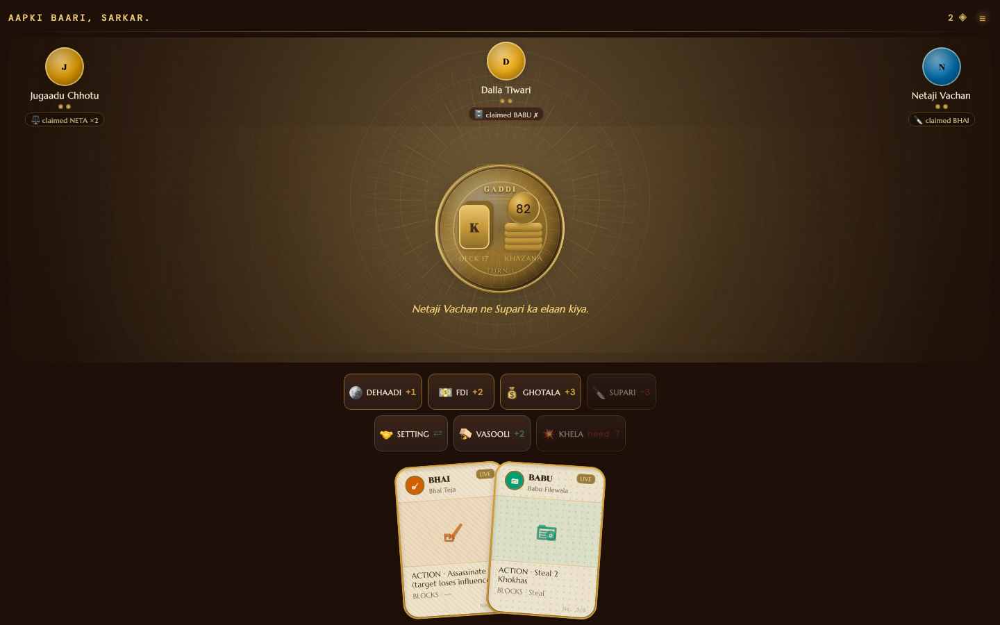

*अब सिर्फ ज़रूरी बात।* — Just what matters, now.

Every screenshot in `docs/screenshots/` is rendered headlessly on the JVM by
`:cmp-desktop:renderScreens` and committed back to `main` by `screenshots.yml` on every push, so
baselines never drift from what's actually in the repo. The flow GIFs in `docs/gifs/` are stitched
from those same PNG frames with `scripts/make_flow_gifs.sh` (ffmpeg). Rather than one static
gallery, they're woven into the walkthrough below wherever they explain something better than
prose: [Home](#home) · [The six roles](#the-six-roles) · [How you play](#how-you-play) ·
[DARBAR](#darbar--the-social-layer) · [The ten personas](#the-ten-personas) ·
[Decision Coach](#decision-coach) · [Game modes](#game-modes) ·
[Career, replay, and ranking](#career-replay-and-ranking) · [Online play](#online-play) ·
[Onboarding](#onboarding) · [Reference & accessibility](#reference--accessibility).

---

## The three-layer table — FOCUS / GUIDED / ANALYST

The single biggest change in this pass: the same live `GameState` is now rendered at three
progressive-disclosure densities instead of one, via `DensityLayer` (`feature/game/DensityLayer.kt`).

| Layer | What's on screen | Who it's for |
|---|---|---|
| **FOCUS** | Whose turn, one plain-language headline (`BeatHeadline`), your hand, your legal actions. No suspicion pips, no coach badges, no dossier chits, no event log, no Darbar tray. | A first-time player who needs to see the table, not an instrument panel. |
| **GUIDED** | Everything in FOCUS, plus one suggestion at a time. | A player past the tutorial but not yet reading the room unassisted. |
| **ANALYST** | The full panel: suspicion pips, coach badges + odds, opponent dossiers, the event log, Darbar chat. | The rules-lawyer table this game always supported — unchanged from before the overhaul. |

Nothing about the ANALYST density changed underneath — `4p_mid_claim.png` below is the same fixture
it always was. `4p_focus.png` is the **same table, same state**, rendered through the FOCUS gate:


**Graduation is earned, not forced.** `evaluateDensityGraduation` (pure function, unit-tested) advances a player FOCUS → GUIDED → ANALYST purely off `StatsLedger.games` and the same `DecisionGrade` competence read the career dossier already computes — faster if their accuracy/EV-bled numbers show real competence, never sideways or backward, and **never** overriding a manual choice from Settings. First-run funnel routing pins a brand-new player at FOCUS the moment they finish the tutorial (`KursiApp.kt`); everyone who played before the overhaul keeps ANALYST, since nothing forces an existing player back down a density they were already reading fine.

**Beat-gate pacing** ties into the same FOCUS/GUIDED path: instead of the event log scrolling past what just happened, the table holds on a meaningful beat and shows a tap-to-continue prompt (`BeatGatePrompt.kt`) — tap, click, or Space on desktop — so a new player actually sees the reveal before the next claim buries it.

---

## Sarkari Noir — the AAA visual system


Every screen in this build — not just the game board — was rebuilt against one written design
language, [`docs/design-language.md`](docs/design-language.md): a warm overhead lamp on
teak/aged-brass/document-paper, enforced structurally rather than left to per-screen taste.

- **No bordered boxes.** Depth comes from shadow + material, never a 1–2dp outline framing a region.
- **Crafted elements.** Buttons are raised stamps (gold-fill for primary, dark+brass-hairline for secondary). Cards are aged paper with a brass double-rim. Avatars are brass-rimmed discs with a role-hued radial fill.
- **Engraved chrome.** Headers are a small-caps DM Mono eyebrow + a hairline gold rule, or a sparing Rozha One display title — never a full-width filled gradient bar.
- **One accent.** Oxblood/stamp-red is reserved for the single element that needs attention; gold is primary/focal; everything else recedes into warm neutrals.
- **Ground truth = the render.** The checklist's last line is literal: every screen is self-checked against its own `cmp-desktop/build/shots/<name>.png` fixture before it ships, not against a mockup.

This is why the render harness in `cmp-desktop/src/jvmMain/kotlin/com/kursi/desktop/Screenshots.kt`
matters as much as it does — it's the actual QA loop this visual system was built with, not an
afterthought bolted on for the README.

---

## The world

The Neta has been making promises since before you were born and has the file extensions to prove it. The Bhai owns three silences and a steel foundry. The Babu's approval has been pending since 2007. The Jugaadu knows someone who knows someone who knows a shortcut. The Vakil has already read the clause that saves him. The Patrakaar has a source inside. 

You're at the table. So are they.  
The chair at the head is empty.

---

## Home

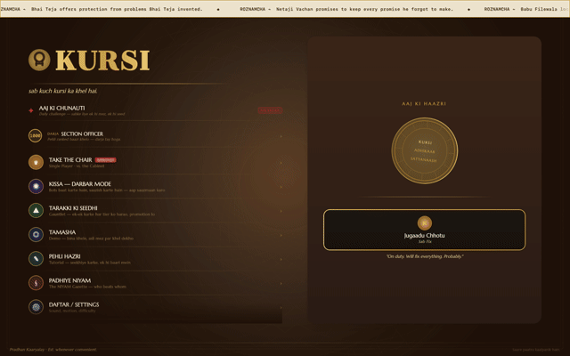

*Fresh install → GAUNTLET preview → KISSA preview → a loaded career (ranked + daily + gauntlet) → mid-match resume.*

The home screen has eight mode tiles across two columns — **New Game**, **KISSA** (story campaign), **GAUNTLET** (rung ladder), **TAMASHA** (spectate AI), **Tutorial**, **Rules / Gazette**, **Settings**, and **Multiplayer** (online, flagged PENDING SANCTION until server key is present). Selecting any tile opens a mode preview in the right panel with a full description, key details, and an ENTER button.

Above the grid, continuity strips surface everything in progress: the **Aaj ki Chunauti** daily challenge with your current streak, your **ELO rank** (SECTION OFFICER → UNDER SECRETARY → DEWAN and above), **TARAKKI KI SEEDHI** gauntlet progress, career win-rate, and a one-tap **resume strip** when a match is in flight. A rotating ROZNAMCHA ticker scrolls satirical headlines across the top. The brass seal and your current on-duty bot persona appear in the right panel by default.

---

## The six roles


All six roles are in the Niyam Gazette, available mid-game without interrupting play.

Everyone at the table holds two cards — face-down. On your turn you claim any role and take the matching action, whether you actually hold it or not. Challenges and blocks are also claims. The whole table is lying. The question is who gets caught.

---

### Neta — Netaji Dhanpat Rai Vachan
*The Eternal Candidate. Made entirely of promises.*

Takes **GHOTALA** — the party's share of FDI, routed correctly, he assures you. +3 Khokha (coins). Has taken it every time. Will take it again. Also blocks everyone else from taking **FDI** (Foreign Aid, +2) — that money was already committed to a constituency project.

**Action:** GHOTALA +3 · **Blocks:** FDI (Foreign Aid)

---

### Bhai — Bhai Teja  
*Owns the Silence. Quiet, slow, unbothered.*

Issues **SUPARI**. It costs 3 Khokha, and the target loses an influence card. Bhai doesn't explain. He also doesn't need to. No one blocks Supari except the one lawyer everyone keeps around for exactly this.

**Action:** SUPARI — pay 3, target loses a card · **Blocks:** —

---

### Babu — Babu Filewala
*Approver of Nothing. Power through the comma.*

Does **VASOOLI** — extracts 2 Khokha directly from another player. The collection is official. The paperwork is in order. Also blocks Vasooli from others — that file for unauthorized extraction has already been rejected at his desk.

**Action:** VASOOLI — steal 2 from target · **Blocks:** VASOOLI (Steal)

---

### Jugaadu — Jugaadu Chhotu
*The Fix-It Man. Solutions mostly illegal.*

Does **SETTING** — draws two extra cards from the pile, keeps what he wants, returns the rest. Nobody knows what he's holding after a Setting. Also blocks Vasooli — something in his arrangement makes the extraction impractical.

**Action:** SETTING — draw 2, keep what you need · **Blocks:** VASOOLI (Steal)

---

### Vakil — Vakil Loophole
*The Silver Tongue. Knows three exceptions to every rule.*

Has no action of his own. Doesn't need one. Blocks **SUPARI** — the Assassin's move hits a procedural wall every time. Whatever exception applies, Vakil has already filed the brief.

**Action:** — · **Blocks:** SUPARI (Assassinate)

---

### Patrakaar — *the 6th role, enters at larger tables*
*Has a source inside. Knows things no one said out loud.*

Does **JAANCH** — privately examines one of a target's face-down cards. The Patrakaar alone learns what it is. Then decides: let it stay, or force the target to shuffle it back into the deck and draw again. An information-then-disruption move. Not blockable.

**Action:** JAANCH — secretly examine a target's card; optionally force reshuffle · **Blocks:** —

---

## How you play

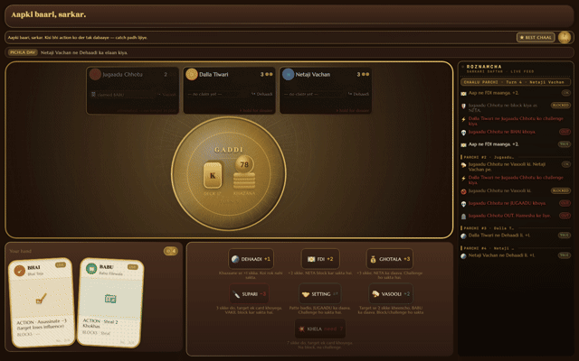

*One turn end-to-end: pick an action → confirm the claim → the table reacts → a block with live odds → an exchange → influence lost → game over → the stamped result.*

Everyone starts with 2 Khokha and 2 cards. On your turn:

- **DEHAADI** — take 1 coin. No claim, no block, no challenge. Always legal.
- **FDI** — take 2 coins. No claim needed. Neta can block it.
- **GHOTALA** — claim Neta, take 3. Anyone can challenge your claim.
- **SUPARI** — claim Bhai, pay 3, target loses a card. Vakil can block. Anyone can challenge.
- **VASOOLI** — claim Babu, steal 2 from a target. Babu or Jugaadu can block. Anyone can challenge.
- **SETTING** — claim Jugaadu, draw 2 and pick which to keep. Anyone can challenge.
- **JAANCH** — claim Patrakaar (6+ player tables), privately examine a target's card. Anyone can challenge.
- **KHELA** — pay 7, pick a target, they lose a card. No claim, no block, no challenge. Mandatory at 10 coins.

**Challenge:** If you think a claim is false, challenge it. The claimant flips the card. Caught lying — they lose influence. Truthful — the challenger loses influence instead. A surviving, proven claim gets shuffled back and redrawn.

**Block:** Claim the blocking role. The original actor can challenge your block — same rules apply. If no one challenges, the block stands.

Last player with influence wins the **Gaddi**.

---

## DARBAR — the social layer

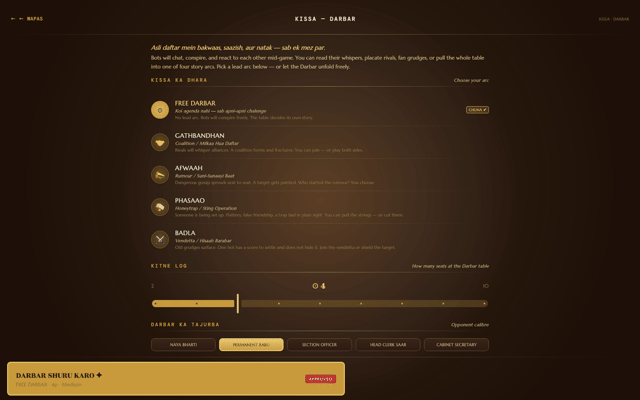

*Pick a KISSA arc → a live Darbar table with an Afwaah in flight: bots pile on, the tray shows what you can say to fuel it or let it burn.*

DARBAR is the layer above the engine. Bots have memory, moods, and grudges. They talk to each other. They form pacts. They spread stories. And you can intervene — strategically.

Four story arcs run simultaneously, triggered by in-game events:

**GATHBANDHAN** — Two bots make a quiet agreement to not target each other. The whisper is visible at the table. The defection, eventually, is not. Watch for who breaks first.

**AFWAAH** — Someone starts a rumour about another player's role. It spreads across the table. Players begin acting on it — targeting the accused, avoiding them, adjusting their own claims — even when the rumour isn't true. Especially when it isn't.

**STING** — A bot "leaks" a real card claim. Now the whole table knows what that player is supposedly holding. The target has to decide: act normally and invite the read, or overcorrect and invite suspicion.

**BADLA** — You SUPARI someone. They announce it. They follow through on it — even when it costs them strategically. Grudges don't expire at the end of the round.

As the human, you can **fuel an Afwaah**, **broker a Gathbandhan** with a bot, **taunt** someone into a Badla, or **leak** information to start a Sting. The chat suggestions in the DARBAR tray show what you can say and what arc it advances.

The social layer runs on a **deterministic narrative RNG** — separate from the game engine, never affecting card state, resumes byte-for-byte across save/reload.

---

## KISSA — story arcs mode

KISSA is the story-mode entry point to DARBAR. Pick a narrative arc to start with: run a Gathbandhan from turn one, or seed an Afwaah before the first GHOTALA. The bots have backstories and the table has a script. What you do with it is up to you.

---

## The ten personas


Ten bot personalities, assigned at match start by the **Hazri Register** (lobby). Each bluffs differently. Each has tells.

| Persona | Their thing |
|---------|-------------|
| **Netaji Vachan** | Claims his role even when holding someone else's card. Always has. Always will. Completely unbothered. |
| **Bhai Teja** | Goes silent before he strikes. The longer the pause between actions, the closer the Supari. |
| **Babu Filewala** | Taxis to DEHAADI obsessively — builds patiently, never exposes himself — until the moment he doesn't have to. |
| **Jugaadu Chhotu** | Does something unpredictable every time. Difficult to read because there is genuinely nothing to read. |
| **Vakil Loophole** | Challenges on principle. Every claim is suspicious. Every block is grounds for inquiry. |
| **Didi** | Vengeance is her love language. If you touch her, she follows through. No hurry. |
| **Madam Ji** | Always two moves ahead. Doesn't react — repositions. Never acts from emotion. |
| **Sharmaji's Son** | Learns nothing. Makes the same call every time. Infuriating if you expect any adaptation. |
| **Inspector Reddy** | By-the-book — for the right bribe. Claims blocking roles constantly. Procedure is leverage. |
| **Startup Bro** | Pivots every round. Each turn is a new grand strategy. Disrupts his own positions regularly. |

Each persona plays a statistically distinct policy. Didi's retaliation timing, Madam Ji's patience, Inspector Reddy's block-frequency — all measurable in the career head-to-head record.

---

## Decision Coach

The coach runs **ISMCTS** (Information Set Monte Carlo Tree Search) in the background — the same algorithm running the bots, turned toward advising you. It has only the information you have: the table-visible event log, standing claims, who got caught bluffing and when.

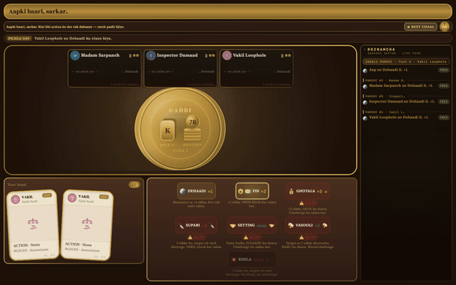

*Coach on the action dock → long-press an opponent for their dossier → long-press your move for the bluff-risk chit → coach on the reaction window → coach off, table silent → rival claims still visible on every plate.*

Every action chip gets annotated: the **recommended move** gets a brass star. Claim-bearing actions get a **REAL** or **BLUFF** badge and a **P(it flies)** odds pill. On the target-pick dock, the **weakest target** gets flagged.

Long-press an opponent's plate to open their **dossier chit**: posterior probability over their likely roles, all standing role claims, bluff-caught count, and inferred bluff rate — built from the public event record.

Long-press your pending action to open the **risk chit**: the probability your claim gets challenged, and the EV impact if it does.

Coach can be toggled off in Settings. When off, the table is silent — no odds, no stars, no badges. All observational tools (dossier chit, risk chit, standing claims, suspicion pips, event log) remain visible regardless. Coach is advisory; the read is always yours.

---

## The Munshi — AI narrator

DARBAR's chat feed and the coach's odds are structured data. The **Munshi** (`ai/src/commonMain/kotlin/com/kursi/ai/MunshiNarrator.kt`) turns that plus the recent public event log into one grounded, in-character sentence — the same headline `BeatHeadline` shows at FOCUS/GUIDED density, upgraded in place when a better source is available.

**Provider matrix (spec §8.5), tried in order:**

1. **On-device** — auto-detected, zero setup for the player (Gemini Nano on Android, Apple FoundationModels on iOS 26).
2. **BYOK cloud** — any provider (Anthropic/OpenAI/Gemini) the player has explicitly opted into with their own key; a null key simply never enters the chain (`buildProviderChain`), so it's inert by default, not a hidden network call.
3. **Templated floor** — the copy already used everywhere else in the game (`KursiVoice.recap`). The Munshi reports this tier back to its caller as `null` rather than synthetic text, so the templated line at the call site is always the truthful fallback, never a stand-in the narrator pretends to have written.

**Latency and guardrails:** a plain suspend call with its own internal timeout — it never blocks a beat, since the templated line has already rendered synchronously by the time the Munshi is invoked; a non-null result only ever upgrades that line after the fact. It never sees hidden cards (inputs are already redacted/public-only), never mutates `GameState`, never gates a legal action, and is never persisted into the replay record — display-only, always regenerable.

---

## Game modes

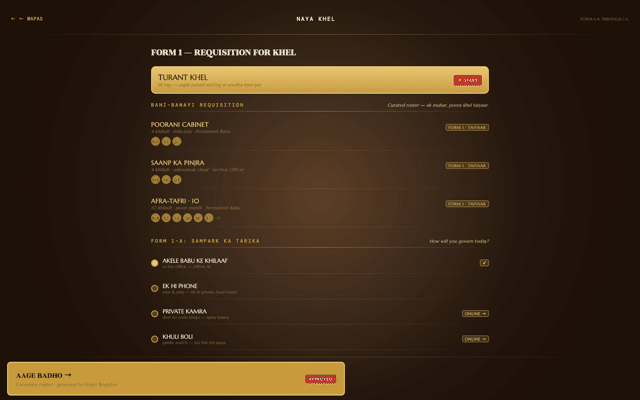

*Setup → Team Khel toggle → GAUNTLET ladder → a 2v2 team table → TAMASHA watch-mode → the pass-and-play handoff guard.*

### vs AI
1 human vs 1–9 bot opponents. Set player count, difficulty, and whether DARBAR is active.

**Difficulty levels:** Easy (scripted play-caller), Medium (ISMCTS 200 iterations), Hard (ISMCTS 2000 + coach-level search), Expert, Grandmaster.

---

### GAUNTLET — Tarakki ki Seedhi (Promotion Ladder)

Five rungs. Win to climb. Lose and stay. You keep your rung — no snakes, no falls.

| Rung | Players | Difficulty |
|------|---------|------------|
| Rung 1 | 3p | Easy |
| Rung 2 | 3p | Medium |
| Rung 3 | 4p | Hard |
| Rung 4 | 5p | Expert |
| Rung 5 | 6p | Grandmaster |

Clear Rung 5 and the Gaddi is yours.

---

### Team Khel — Faction Play

Two factions. **Allies are never legal targets** — engine rule, not convention. Targeting your own teammate is a structurally illegal move. Faction badges appear on every plate. Win as a team; the last surviving faction takes the table.

---

### DARBAR
The full social-layer mode: all four arcs active, bots chat, player suggestions live in the tray. Separate from ranked play — ranked runs the clean AI with no social layer; DARBAR is for narrative, story, and exhibition.

---

### TAMASHA — Watch Mode

AI plays every seat. Spectator banner, no action controls. Watch ten personas destroy each other, form pacts, break them, and fight over the Gaddi. Good for a demonstration or for understanding how the personas read the table differently.

---

### Pass-and-play — Hot-seat Multiplayer

Multiple humans, one device. After each turn, a **handoff guard** blanks the screen and prompts the next player to take the device — so face-down cards stay hidden between turns. No accounts, no network required.

---

### Vishesh Modes — Experimental Variants

Seven additive rule variants, toggleable per-match from the Setup screen. All default **off**; classic rules are byte-for-byte unchanged when all are disabled. Variants can be combined freely.

| Variant | Hindi name | What it does |
|---------|-----------|--------------|
| **Bail Pe Bahar** | बेल पे बाहर | Pay 9 coins to flip one revealed (face-up) card back face-down. Buys a second life — at a cost. |
| **Bali Khel** | बलि खेल | Sacrifice one of your own face-down cards to gain 3 coins. Voluntary influence loss for tempo. |
| **Hawala** | हवाला | Gift up to 5 coins directly to any alive opponent, bypassing the treasury. Under-the-table transfers. |
| **Adhyadesh** | अध्यादेश | Once you've **earned** ≥ 25 lifetime coins, you can declare Emergency — pay all your coins and force every other player to lose one card. One-time nuclear option. |
| **Khazana Raj** | खजाना राज | First player to **accumulate** a target amount (25 / 50 / 100) of lifetime earned coins wins the game outright — regardless of how many players are still alive. Changes the game from elimination to a coin race with four Darja milestones: Mukhiya → Sahib → Mantri → Sarkar. |
| **Mehengai** | महँगाई | All coin costs (Coup + Assassinate) increase by 1 every few turns — inflation is real. |
| **Tangi** | तंगी | Total coin supply is capped below the classic formula. Hoarding and denial become dominant strategies. |

---

### 2–10 players

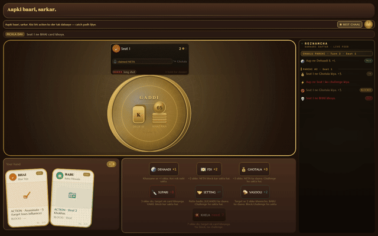

*The same engine at 2, 4, and 10 seats — the table reshapes from a fast duel to a loud ten-hand darbar.*

At 2 players, SUPARI + KHELA dynamics dominate — the coin race is fast. At 10 players, the PATRAKAAR (6th role) enters the deck; the Jaanch information-asymmetry and the social layer make the table genuinely loud.

---

## Career, replay, and ranking

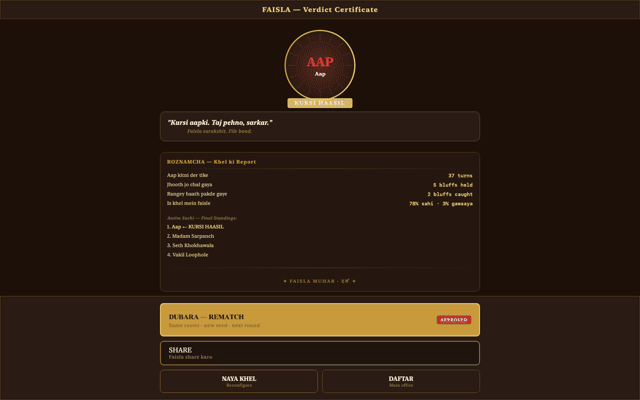

*Results certificate → record-expired empty state → the Roznamcha career dossier → local ELO with spark-line → online standings → the replay scrubber with advisor annotation → recent matches.*

### Results certificate

After every game: a stamped certificate. Winner, final standings, bluffs held, bluffs caught, and a **decision-quality recap** — how closely your moves matched the ISMCTS best-move at each decision point, average EV bled, and challenge accuracy. Share it directly.

---

### Roznamcha — Career Dossier

Lifetime stats: games, wins, bluffs held, bluffs caught. Head-to-head records against each bot persona — who you've played, and who you've beaten. A **decision-quality ledger** that accumulates across all games: accuracy against ISMCTS best-move, average EV bled per decision, challenge accuracy %, bluff success rate.

---

### Darja-suchi — Local Ranking

Local ELO with a 14-game rating history spark-line. Daily challenge (Aaj ki Chunauti) that resets each day. Streak counter with best-streak history. When connected to the Ktor server, an **online standings board** appears alongside local — server-backed real-time rankings.

---

### Replay Scrubber

Every completed match is stored as `(seed, intentLog)`. The replay reconstructs the game state **byte-for-byte** from that pair — no snapshots required. Step through each decision. At annotated moments, see what the coach would have recommended and how your move compared. Available from the career screen for recent matches.

---

## Online play

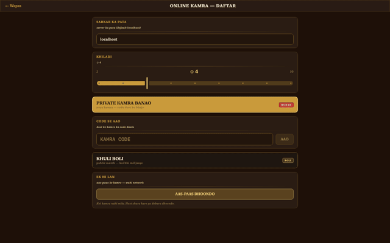

*Mode picker → LAN browse (discovered hosts) → waiting room with code + seats → a dropped connection and its reconnect banner.*

**Private room by code** — create a room, share the 4-letter code. Anyone with the code joins.

**Quick-match** — matchmake against whoever is waiting.

**LAN discovery** — Bonjour/mDNS browse shows all Kursi games on the local network. No manual IP entry.

The authoritative server is **Ktor/Netty**. All game state lives server-side. Clients receive only their redacted `PlayerView` — the server never sends information a player shouldn't have. A disconnected player auto-passes on their turn until they reconnect.

---

## Onboarding

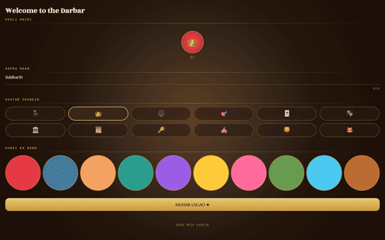

*First run: set your name, avatar and seat colour (PEHLI HAZRI) → the scripted tutorial table → the guaranteed bluff-caught teaching beat → land on Home.*

### Pehli Hazri — Interactive Tutorial

Scripted table with guaranteed teaching beats. Beat 7 is the lesson that matters: a NETA claim gets challenged and the card flips to BHAI. The **JHOOTH** (liar) verdict stamp lands. The bluffer loses influence. You can't exit the tutorial without seeing it happen.

Three more beats teach the mechanics FOCUS/GUIDED players would otherwise never see explained: a BLOCK (Vakil stopping a Supari), the unblockable KHELA/Coup, and an Exchange (Setting) — one mechanic at a time, each in its own un-acted "prompting" state.

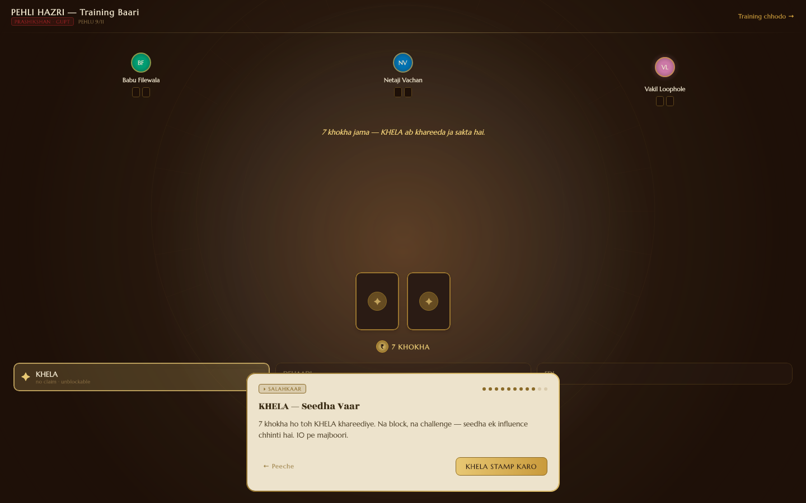

Finishing the tutorial for the first time pins a brand-new player at **FOCUS** density (`KursiApp.kt`'s first-run funnel routing) — the three-layer table above starts everyone at the calmest view, not the full instrument panel.

---

### Setup

Set player count (2–10), difficulty, play mode (vs AI / DARBAR / TAMASHA / Pass-and-play), and whether Team Khel is active. Team Khel appears when 4+ players are selected and is the only option that restructures the engine-level legality of targets.

---

### Niyam Gazette — Rule Reference

Pull up mid-game without leaving the table. Three tabs: roles and their powers, all actions with coin costs, and the DARBAR arc reference. Includes PATRAKAAR when the 6th role is in play.

---

## Reference & accessibility


*The Niyam Gazette (roles / actions / arcs) → the reduced-motion static-frame gallery → Settings.*

Every game moment (income, coin steal, role reveal, influence loss, elimination, coup, win) has a **tailored static end-frame** when reduced motion is on — not a generic fade. GHOTALA shows a held stamp. SUPARI shows the tipped chair. KHELA shows the KURSI crest. Okabe-Ito CVD-safe palette for all role colours. Full VoiceOver/TalkBack support with semantic properties and traversal order.

---

## Shader material layer & sound

The felt table and key panels get a per-pixel material pass rather than a static gradient:
`core/designsystem/src/commonMain/kotlin/com/kursi/designsystem/shader/MaterialShaders.kt` holds one
shared AGSL/SkSL source string (animated film grain + a warm bloom lift around the lamp key-light
pool) that compiles unmodified as AGSL on Android's `android.graphics.RuntimeShader` (API 33+) and as
SkSL on Skia's `org.jetbrains.skia.RuntimeEffect` (desktop/iOS/wasm) — a single `expect`/`actual`
(`MaterialShader.kt`) picks the right backend per target, falling back to the procedural
Canvas-drawn felt (hatch/guilloché/vignette) underneath on platforms without runtime-shader support.
It's additive polish on top of a real drawn surface, not a filter-demo overlay.

A gated CC0 SFX pipeline (`core/designsystem/.../audio/SoundPlayer.kt`) plays clips on the real game
beats — deal, claim, challenge, reveal, coup, win — decoding lazily per platform actual. Every `play()`
call is wrapped so a missing clip, an unsupported codec, or a headless CI box degrades to silence,
never a crash; callers gate every call on the player's own sound-enabled preference.

---

## Features at a glance

| Area | What's inside |
|---|---|
| Progressive disclosure | 3 densities — FOCUS / GUIDED / ANALYST — via `DensityLayer`, earned graduation off match count + decision quality, manual override always wins |
| Visual system | Sarkari Noir — one enforced material language across every screen (`docs/design-language.md`), no bordered boxes, stamp buttons, brass tokens |
| AI narrator | The Munshi — on-device → BYOK cloud → templated-floor provider chain, upgrades the beat headline in place, never blocks or persists into replay |
| Shader layer | AGSL/SkSL per-pixel grain + bloom material pass on the felt, procedural fallback where runtime shaders aren't supported |
| Audio | Gated CC0 SFX pipeline wired to real game beats, silent-on-failure, player-toggleable |
| Core game | 5 roles (6th — Patrakaar — at 6+ players), 8 actions, challenge/block resolution, 2–10 players |
| Social layer | DARBAR: 4 concurrent bot-driven story arcs (Gathbandhan, Afwaah, Sting, Badla), deterministic narrative RNG |
| Bots | 10 named personas, 5 difficulty tiers (Easy → Grandmaster), ISMCTS-backed at Medium+ |
| Coach | ISMCTS move recommendation, bluff-risk odds, opponent dossier, toggleable, ANALYST density |
| Modes | vs AI, GAUNTLET ladder, Team Khel (factions), DARBAR, TAMASHA spectate, pass-and-play, 7 optional Vishesh rule variants |
| Career | Results certificate, Roznamcha dossier, local ELO + daily streak, byte-for-byte replay scrubber |
| Online | Private room codes, quick-match, LAN/mDNS discovery, authoritative Ktor/Netty server, reconnect handling |
| Accessibility | Reduced-motion tailored end-frames per event, Okabe-Ito CVD-safe palette, full VoiceOver/TalkBack |
| Platforms | Android, iOS, JVM desktop, Kotlin/Wasm — one Compose Multiplatform codebase |

---

## Architecture

```
Kursi/
├── engine/           # (GameState, Intent) → GameState — zero deps, RNG in state
├── ai/               # ISMCTS + 10 personas + social model + cloud/on-device LLM layer
├── server/           # Ktor/Netty authoritative server
├── shared-protocol/  # Wire types (server ↔ client)
├── core/
│   ├── designsystem/ # KursiTheme, RoleGlyph, all UI primitives
│   ├── prefs/        # Career stats, gauntlet progress, resume snapshot, API key store
│   └── network/      # Ktor WS client + LAN discovery
├── feature/game/     # GameScreen, GameViewModel, GameSession, DARBAR narrative engine
├── cmp-shared/       # NavHost + all screens (shared Compose UI)
├── cmp-android/      # Android shell — FCM, adaptive icons, in-app review/update
├── cmp-ios/          # iOS KMP framework — APNs, StoreKit review, App Store update check
├── cmp-desktop/      # JVM desktop + headless render harness
├── cmp-web/          # Kotlin/Wasm browser + PWA manifest
└── external/         # kmp-toolkit (mvi-core, feedback, common, bots-policy, network, ai,
                       # llm-chat) and kmp-build-logic, both submodules wired via includeBuild
```

`feedback` (haptics, notification channels, share sheet — `expect`/`actual`) has no local
`core/feedback` module; it's one of the modules vendored in from `external/kmp-toolkit`, same as
`mvi-core` — see [Technical deep dive](#technical-deep-dive).

### Module dependency graph

Direct `project(":...")` dependencies as declared in each module's `build.gradle.kts` — not aspirational, this is what actually resolves:

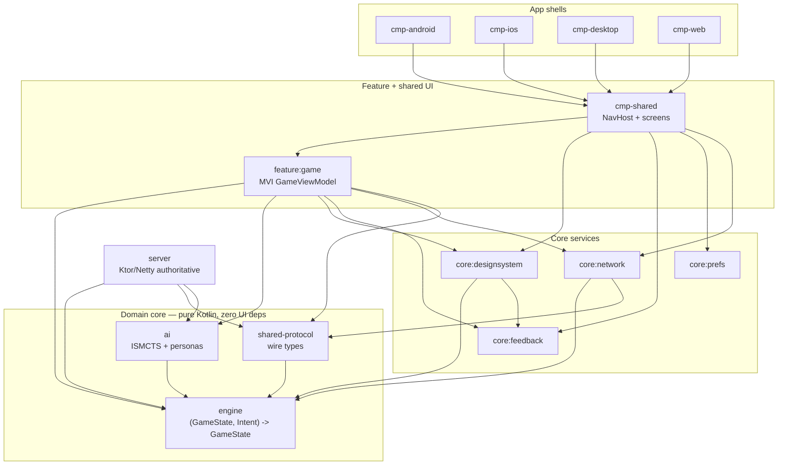

Simplified for readability: a few app shells also take a direct `project()` dependency on `engine`/`ai`/`core:designsystem` for platform-specific wiring (e.g. `cmp-desktop`'s headless render harness) in addition to the path shown through `cmp-shared`/`feature:game`. `engine` itself has zero `project()` dependencies — every arrow in this graph ultimately terminates there.

Things worth calling out:

**Engine is a pure function.** `(GameState, Intent) → GameState` with a counter-based SplitMix64 RNG carried in state. No `Date.now()`, no global random. Any game replays byte-for-byte from `(seed, intentLog)`. Resume, replay, and server authority all work without snapshots — `MatchResumeTest` proves this.

**Secrecy boundary is structural, not convention.** `redact(state, viewer) → PlayerView` is a type-level projection. Another player's face-down roles cannot structurally appear in the view. Bots only see their `PlayerView` — engine-level cheating is impossible by construction, not policy.

**DARBAR narrative doesn't touch the engine.** Two RNG streams: `nudgeRng` advances in strict bot-step order (deterministic across resume) and a cosmetic `rng` for chat timings (never game-affecting). `NarrativeResumeTest` covers this.

**Design system is the enforcement layer.** Every surface routes through `BrassParchmentSurface`, `decoPopoverPaper`, `WaxSeal`, `drawRoleGlyph`. The **License Raj Deco** brand identity — 1950s–70s government-issue document aesthetic, teak `#1A1A2E` / brass `#C99A3B` / cream `#F4ECD8` — is structurally enforced, not left to per-screen taste. **Sarkari Noir** (`docs/design-language.md`) is the AAA execution standard applied on top of those same tokens in this pass — no bordered boxes, shadow+material depth, stamp buttons — across every screen, not just the game board.

**AI layer is provider-agnostic.** The `AiProvider` interface abstracts Anthropic, OpenAI, and Gemini cloud calls, on-device Gemini Nano (Android), and Apple FoundationModels (iOS 26). ISMCTS is the offline fallback. BYOK (bring your own key) stored in EncryptedSharedPreferences / Keychain.

---

## Technical deep dive

Two things worth reading the source for — not the callouts above, not generic KMP boilerplate.

**The RNG is a value, not a service.** `engine/src/commonMain/kotlin/com/kursi/engine/Rng.kt` is 53 lines and carries the entire determinism guarantee. `Rng` wraps an immutable `RngState(seed, step)`; every draw (`nextLong`, `nextInt`, `draw`) takes the current `Rng` and returns `(value, advancedRng)` — nothing mutates, and there's no `kotlin.random.Random` anywhere in `engine`. The mixer is a plain SplitMix64 (`z = (z xor (z ushr 30)) * 0xBF58476D1CE4E5B9`, integer-only), so `(seed, step)` produces identical output on every target the module compiles for — JVM, Android, iOS/Native, Wasm — with no floating point and no platform `Random` implementation to diverge between them. Because the RNG is state threaded through pure functions rather than a mutable service the engine holds onto, a whole match replays byte-for-byte from `(seed, intentLog)` alone — no snapshots. `ScalingGoldenTest` and `MatchResumeTest` (`engine/src/commonTest`, `feature/game/src/commonTest`) are what actually pin that guarantee down.

**A vendored MVI core, not a copy-pasted one.** `GameViewModel` (`feature/game/src/commonMain/kotlin/com/kursi/feature/game/GameViewModel.kt`) is built on a plain `CoroutineScope`, not `androidx.lifecycle.ViewModel` — `cmp-ios` and `cmp-web` can't depend on AndroidX, so the MVI contract has to be platform-neutral. One-shot signals (`GameEffect.IllegalMove`, etc.) go through `EffectEmitter`, which lives in the `mvi-core` module of the [`kmp-toolkit`](https://github.com/darkpandawarrior/kmp-toolkit) monorepo — a *separate git repository*, vendored in as a submodule (`external/kmp-toolkit`) and wired through `includeBuild` in `settings.gradle.kts`, not a module of this repo. The composite build declares an explicit `dependencySubstitution` mapping `com.siddharth.kmp:mvi-core` → `project(":mvi-core")` (and `com.siddharth.kmp:feedback` → `project(":feedback")`), so the published coordinates resolve to the local monorepo modules. Same MVI primitive, reused across projects, versioned once instead of copy-pasted per project.

---

## Getting started

```bash
git clone https://github.com/darkpandawarrior/Kursi.git
cd Kursi

# Fastest path to the full game
./gradlew :cmp-desktop:run

# Android (gms = full-feature build with Firebase/Play Core; noGms = F-Droid/FOSS build)
./gradlew :cmp-android:assembleGmsDebug
adb install -r cmp-android/build/outputs/apk/gms/debug/cmp-android-gms-debug.apk

# All JVM tests
./gradlew jvmTest

# Render screen fixtures (no device needed)
./gradlew :cmp-desktop:renderScreens
```

Signing: `cp keystore.properties.template keystore.properties` and fill in your keystore.

Version bump: `scripts/bump_version.sh --patch|--minor|--major`

---

## Build targets

| Command | Output |
|---------|--------|
| `:cmp-android:assembleGmsDebug` | Debug APK, full feature set |
| `:cmp-android:bundleGmsRelease` | `.aab` for Play Store / Indus Appstore |
| `:cmp-android:assembleNoGmsRelease -Pfdroid` | Reproducible FOSS APK (no Firebase/Play Core) for F-Droid |
| `:cmp-desktop:run` | Launch desktop app |
| `:cmp-desktop:packageDmg` / `packageMsi` / `packageDeb` | Native installers (macOS/Windows/Linux runners respectively) |
| `:cmp-web:wasmJsBrowserDistribution` | Wasm browser build |
| `:cmp-ios:linkReleaseFrameworkIosArm64` | `KursiKit.framework` |
| `:server:installDist` | Runnable server dir (used by `server/Dockerfile`) |
| `make all` | All targets into `outputs/` |

Fastlane:

```bash
bundle install
bundle exec fastlane android internal
bundle exec fastlane ios testflight
```

### Distribution pipelines

All gated on repo secrets and no-ops until configured — see each workflow's header comment:

| Workflow | Target |
|---|---|
| `release.yml` | Play Store internal/beta/production (Android) + TestFlight/App Store (iOS) |
| `publish-fdroid.yml` | Signs the reproducible `noGms` build, publishes to GitHub Releases (fdroiddata binary host) |
| `indus-deploy.yml` | PhonePe Indus Appstore |
| `amazon-appstore-deploy.yml` | Amazon Appstore (App Submission API) |
| `huawei-appgallery-deploy.yml` | Huawei AppGallery (AGC Publish API) |
| `samsung-galaxy-store-deploy.yml` | Samsung Galaxy Store (Content Publish API) |
| `aptoide-deploy.yml` | Aptoide (Uploader API) |
| `desktop-release.yml` | Dmg/Msi/Deb native installers → GitHub Release, per-OS runner matrix |
| `web.yml` | GitHub Pages (wasmJs) |
| `server-deploy.yml` | Fly.io (`fly.toml` + `server/Dockerfile`) |

Not automatable, no CI job:
- **Uptodown** — no public submission API; manual web-form upload.
- **TapTap** — no public submission API; manual upload/contact-support via the developer console
  (gaming-only anyway, but Kursi qualifies).
- **[Obtainium](https://github.com/ImranR98/Obtainium)** — not a store; it tracks the GitHub
  Releases `release.yml` already publishes, no separate config needed.

---

## Roadmap

**Shipped**
- [x] Deterministic engine + ISMCTS bots (Easy → Grandmaster), 10 personas
- [x] DARBAR social layer — 4 story arcs, deterministic narrative RNG
- [x] All 4 client shells building (Android, iOS, desktop, web)
- [x] Ktor/Netty authoritative online server, LAN discovery, reconnect
- [x] Career, ELO, daily challenge, byte-for-byte replay scrubber
- [x] 7 Vishesh (optional) rule variants
- [x] `mvi-core`/`feedback` extracted into the shared `kmp-toolkit` monorepo

**Exploring**
- [ ] First tagged release / GitHub Release (`VERSION` is `1.0.0`, `BUILD_NUMBER` is `0`, nothing cut yet)
- [ ] Populate store-distribution secrets and run a real Play/F-Droid rollout
- [ ] Keep `server-deploy.yml` (Fly.io) running continuously instead of on-demand
- [ ] Online standings board parity with local ELO once the server sees sustained traffic

---

## Version history

No release has been tagged yet. `git tag` returns three entries — `backup/pre-scrub-2026-07-06`,
`pre-toolkit-extraction` and `pre-toolkit-extraction-v2` — all pre-refactor safety markers, not
versions, so there's no `v1.0.0`-style tag history to show. `VERSION` currently reads `1.0.0` and
`BUILD_NUMBER` reads `0`; both are bumped by `scripts/bump_version.sh`, but neither has been cut as
a GitHub Release yet.

What the commits since the project's scaffold actually shipped, dated from `git log`:

| Date | Milestone |
|------|-----------|
| 2026-01-06 | Project scaffold — KMP setup, Gradle wrapper, version catalog |
| 2026-01-13 | `engine`: game types, the `redact` secrecy boundary, SplitMix64 counter RNG |
| 2026-02-10 | `ai`: ISMCTS — determinizer, node sampling, belief model |
| 2026-02-17 | Difficulty tiers Easy → Grandmaster and the 10 named bot personas |
| 2026-03-05 | `core:designsystem`: License Raj Deco theme tokens, role glyphs |
| 2026-03-19 | `feature:game`: game session with deterministic resume, MVI state |
| 2026-04-02 | All 4 client shells (Android, iOS, desktop, web) building |
| 2026-04-23 | `server`: Ktor authoritative game server, invite-code rooms |
| 2026-05-07 | DARBAR: bot chat, social model, alliance system |
| 2026-05-13 | Four DARBAR story arcs — Gathbandhan, Afwaah, Sting, Badla |
| 2026-06-18 | Android FCM push, notification channels, in-app review/update |
| 2026-06-26 | Seven Vishesh Modes (additive gameplay variants) |
| 2026-07-05 | `kmp-mvi-core` vendored in; `GameViewModel` wired to `EffectEmitter` |
| 2026-07-09 | Toolchain + dependencies bumped to the versions in the Tech section below |

Full list: `git log --oneline`.

---

## Docs

- [Game rules PDF](docs/Kursi_Game_Rules-v2.pdf)
- [Visual identity guide](docs/brand/BRAND.md)

---

## Tech

| Layer | Technology |
|---|---|
| Language | Kotlin Multiplatform 2.4.20-Beta1 |
| UI | Compose Multiplatform 1.12.0-beta02 |
| Build | Gradle 9.7.0-milestone-2 · AGP 9.4.0-alpha04 |
| Networking | Ktor 3.5.1 (client + server/Netty) |
| Persistence | multiplatform-settings 1.3.0 |
| Serialization | kotlinx.serialization 1.11.0 |
| Static analysis | detekt 2.0.0-alpha.5 (baseline-gated) · ktlint 14.2.0 |
| Distribution | Fastlane · GitHub Actions (`ci.yml`, `quality.yml` + 9 store-deploy workflows) |

---

## License

CC BY-NC-SA 4.0 — Source code is available for study and non-commercial modification at https://github.com/darkpandawarrior/Kursi. Commercial use requires explicit written permission. 

Copyright (c) 2024–2025 Siddharth Pandalai.

Inspired by *Coup* (Rikki Tahta, Indie Boards and Cards, 2012). Game mechanics are uncopyrightable; all original expression is wholly original. See [LICENSE](LICENSE) and [NOTICE](NOTICE).

*सारे पात्र काल्पनिक हैं।*  
All characters and events are fictional. Satire only.

---

<div align="center">

Sibling repos: [`kmp-toolkit`](https://github.com/darkpandawarrior/kmp-toolkit) · [`kmp-build-logic`](https://github.com/darkpandawarrior/kmp-build-logic) · [Mileway](https://github.com/darkpandawarrior/Mileway) · [PaymentsLab](https://github.com/darkpandawarrior/PaymentsLab) · Portfolio: [cv-siddharth.vercel.app](https://cv-siddharth.vercel.app/)

</div>
